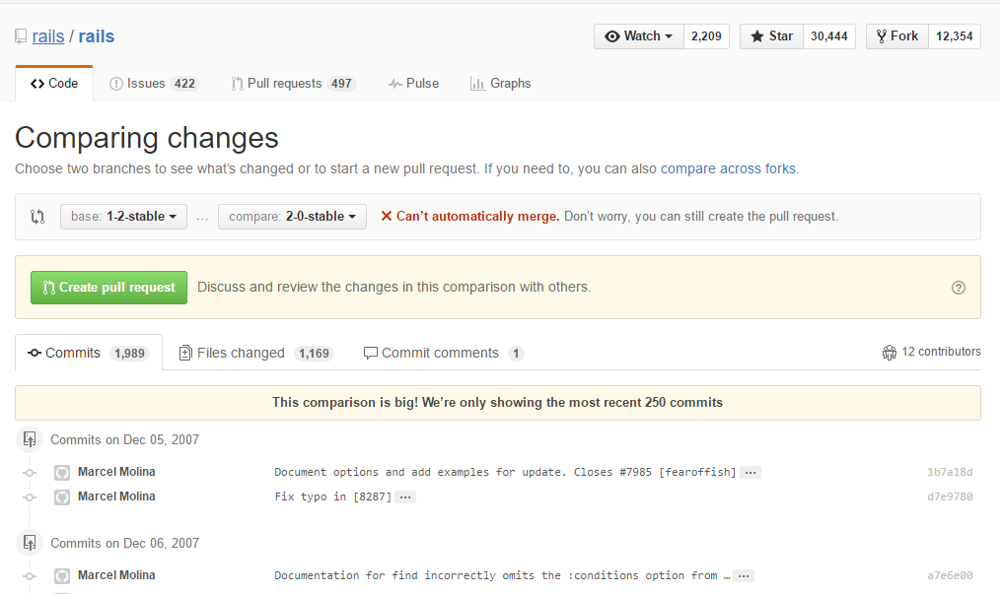
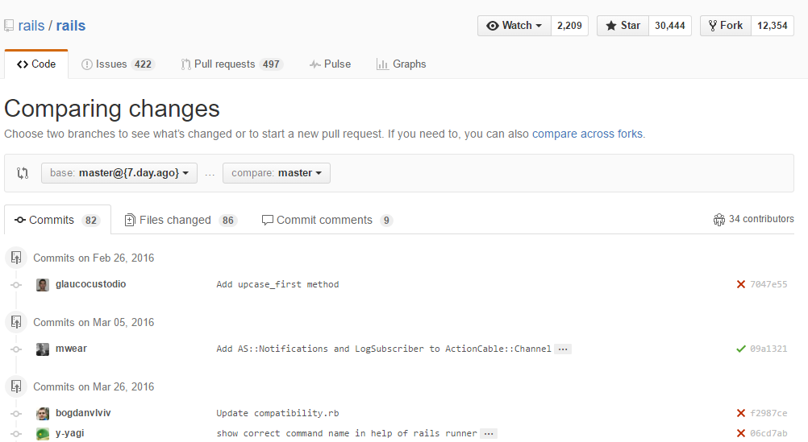
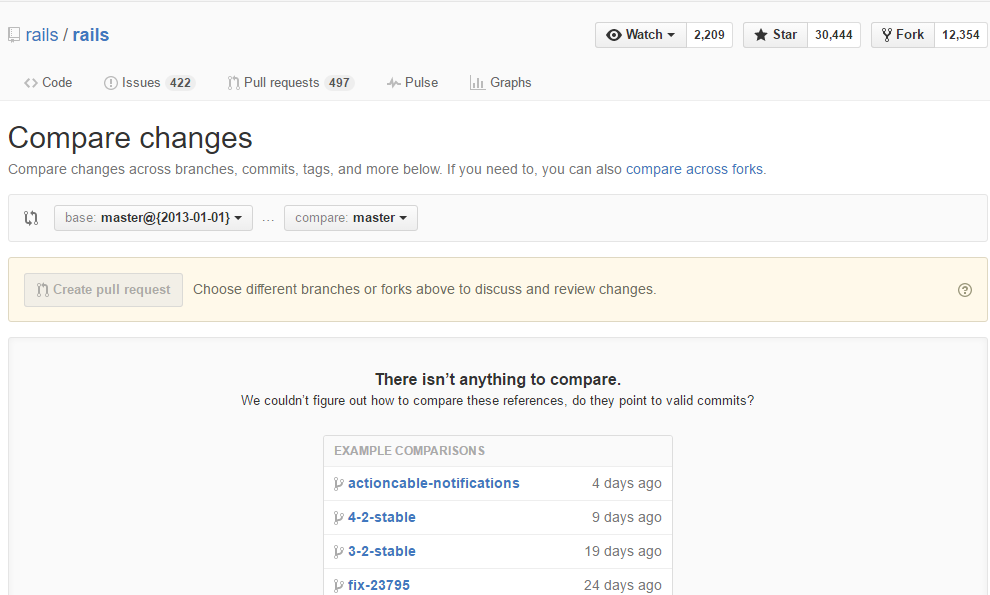

在GitHub上，直接修改URL就可以让用户以多种形式查看差别。这里我以[Ruby on rails](https://github.com/rails/rails)的仓库为例，给各位介绍直接修改URL的一些技巧。

查看分支之间的差别
=============================
比如我们想看1-2-stable分支与2-0-stable分支之间的差别，可以像下面这样将分支名加到URL里。
```
https://github.com/rails/rails/compare/1-2-stable...2-0-stable
```
这样，就可以查看两个分支间的差别了。可以看到，有12名程序员经过1989次提交，完成了1.2版本到2.0版本的升级工作。


查看与几天前的差别
==============================
加入我们想查看master分支在最近7天的差别，可以像下面这样将时间加入URL。
```
https://github.com/rails/rails/compare/master@{7.day.ago}...master
```
这样，就可以查看这段时间内的差别。

+ day
+ week
+ month
+ year

指定期间可以使用以上四个时间单位。如果差别过大则不会列出所有提交，只显示最近的一部分。

查看与指定日期之间的差别
============================
假如我们想看master分支2013年1月1日与现在的区别，可以将日期加入URL。
```
https://github.com/rails/rails/compare/master@{2013-01-01}...master
```
这样，便可以查看与指定日期之间的差别。但是如果指定日期与现在的差别过大，或者指定日期过于久远，则无法显示。
