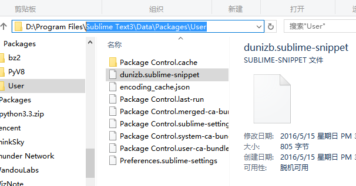

我们在编写代码的时候，总会遇到一些需要反复使用的代码片段。这时候就需要反复的复制和黏贴，大大影响效率。我们利用Sublime Text的snippet（代码片段）功能，就能很好的解决这一问题。通俗的讲，就是把我们常用的代码分别保存起啦，然后通过插件的形式来反复调用。

创建方法：Tools （工具）> New Snippet（新片段）

此时，会出现如下代码：
```
<snippet>
	<content><![CDATA[
Hello, ${1:this} is a ${2:snippet}.
]]></content>
	<!-- Optional: Set a tabTrigger to define how to trigger the snippet -->
	<!-- <tabTrigger>hello</tabTrigger> -->
	<!-- Optional: Set a scope to limit where the snippet will trigger -->
	<!-- <scope>source.python</scope> -->
	<!-- <description>description</description> -->
</snippet>
```
其中，content中由CDATA包裹起来的部分是我们要插入的代码片段，可选。

tabTrigger是我们tab键触发的自动补全代码功能的一个名字，可选。

scope，可选，使用范围，不填写代表对所有文件有效。附：source.css和test.html分别对应不同文件。

description，可选，在snippet菜单中的显示说明（支持中文）。如果不定义，菜单则显示当前文件的文件名。

${1:this}表示代码插入后，光标所停留的位置，可同时插入多个。其中:this为自定义参数（可选）。
${2}表示代码插入后，按Tab键，光标会根据顺序跳转到相应位置（以此类推）。

现在，你应该有了个大致的了解。那我们就开始自己动手编写一个实例。我们都知道，再Sublime中，输入！或者html:5再按tab键，可以自动补全HTML结构，但是这个结果相对很简单，我自己扩展了它的结果内容，新增了几个mate标签，增加了页面描述。
```
<snippet>
	<content><![CDATA[
<!DOCTYPE html>
<html lang="en">
<head>
	<meta charset="UTF-8">
	<title>Document</title>
	<meta name="Generator" content="Sublime Text3">
	<meta name="Author" content="dunizb">
    <meta name="website" content="http://www.mybry.com">
    <meta name="Description" content="读你，这世间唯有梦想和好姑娘不可辜负~~">
    <link type="image/x-icon" rel="shortcut icon" href="image/favicon.ico" />
	<script type="text/javascript">
		${1:}
	</script>
<body>
    ${2:这是html内容}
</body>
</html>
]]></content>
	<!-- Optional: Set a tabTrigger to define how to trigger the snippet -->
	<tabTrigger>hjs</tabTrigger>
	<!-- Optional: Set a scope to limit where the snippet will trigger -->
	<!-- <scope>source.python</scope> -->
	<description>custom-html</description>
</snippet>
```
然后保存代码片段，保存到Sublime Text3\Data\Packages\User下面，取个名字



就这样，在HTML页面中输入hjs+tab，就可以自动补全这一系列代码了。