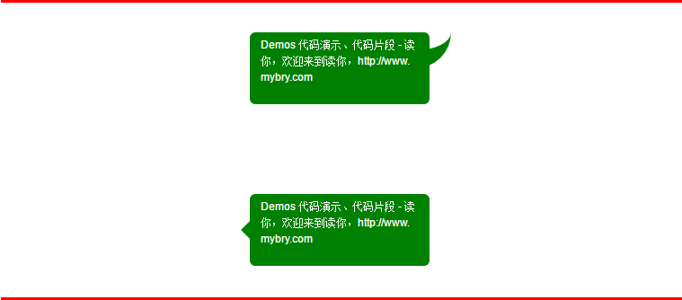
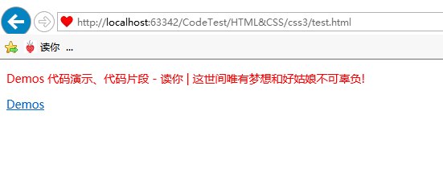
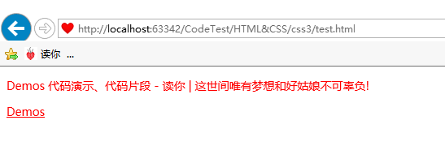
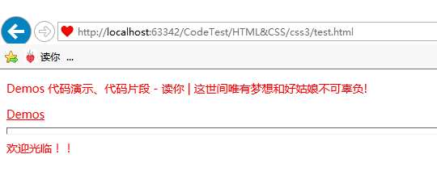
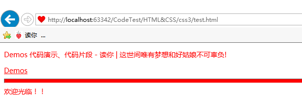

效果如上图所示，主要用到CSS3的伪类`::after`、`::before`，以及圆角边框`border-radius`属性。对于下面的气泡框，可以有两种方式实现小三角：
+ 传统方式，利用CSS画小三角，利用到了透明背景和边框属性`transparent`的应用。
+ CSS3的`transform`属性的使用

然后通过`position`定位到合适的位置。

此外，本文还会讲一下CSS的`inherit`属性值的知识。

#实现气泡框

HTML结果也很简单，就一个DIV。下三角部分使用了CSS画三角的知识，

HTML：
```html
<div class="message1">
    Demos 代码演示、代码片段 - 读你，欢迎来到读你，http://www.mybry.com
</div>

<div class="message2">
    Demos 代码演示、代码片段 - 读你，欢迎来到读你，http://www.mybry.com
</div>
```
CSS：
```css
.message1,.message2 {
    width: 200px;
    height: 80px;
    margin: 100px auto;
    background-color: green;
    border-bottom-color:green;/*为了给after伪元素自动继承*/
    color: #fff;
    font-size: 12px;
    font-family: Arial;
    line-height: 18px;
    padding: 5px 12px 5px 12px;
    box-sizing: border-box;
    border-radius: 6px;
    position: relative;
    word-break: break-all;
}
.message1::after {
    content: '';
    position: absolute;
    top: 0;
    right: -24px;
    width: 20px;
    height: 20px;
    border-width: 0 0 20px 20px;
    border-style: solid;
    border-bottom-color: inherit;   /*自动继承父元素的border-bottom-color*/
    border-left-color: transparent;
    border-radius: 0 0 60px 0;
}
/** 通过对小正方形旋转45度解决 **/
.message2::before {
    content: '';
    position: absolute;
    top: 50%;
    left: -5px;
    width: 10px;
    height: 10px;
    margin-top: -10px;
    background: inherit;/*自动继承父元素的背景*/
    transform: rotate(45deg);
}

/** 通过画三角形解决 */
/*.message2::before {*/
    /*content: '';*/
    /*position: absolute;*/
    /*top: 50%;*/
    /*left: -20px;*/
    /*width: 0px;*/
    /*height: 0px;*/
    /*margin-top: -10px;*/
    /*border-width: 10px;*/
    /*border-style: solid;*/
    /*border-color: transparent green transparent transparent;*/
/*}*/
```
以上就是全部代码。
上面对小正方形使用了inherit属性值，通过把正方形旋转45度形成对外的三角而得到。

# 被刻意遗忘的inherit关键字

尽管绝大多数人都知道inherit这个关键字，但是很多人可能自始自终都没实际用过它，包括我自己，从来没有，在查询CSS文档时，习惯性的忽略它，直到看到《CSS揭秘》这本书。

`inherit`可以用在任何CSS属性中，这从w3cschool文档中就已经体现了，它总是绑定到父元素的计算值（对伪元素来说，则会取生成该伪元素的宿主元素）。举例来说，要把表单元素的字体设定为与页面的其他部分相同，你并不需要重复指定字体属性，只需要利用`inherit`的特性即可：
```css
input,select,button { font: inherit }
```
与此类似，要把超链接的颜色设定为与页面中其他文本相同，还是要用`inherir`，比如下面的代码：
HTML：
```html
<div class="article">
    <p>Demos 代码演示、代码片段 - 读你 | 这世间唯有梦想和好姑娘不可辜负!</p>
    <a href="http://www.mybry.com/demo/">Demos</a>
</div>
```
CSS：
```css
.article {
      font-family: "Microsoft YaHei";
      font-size: 14px;
      color: red;
}
```
效果：


此时文字的颜色是红色，而超链接默认是蓝色，并不会被改变，这是我们都知道的，那么我想让超链接也是跟父元素一样的红色呢？此时我们只需要给超链接inherit即可：
```css
.article a { color: inherit; }
```
效果：


这个inherit对于背景色相同非常有用，但是需要注意的是，想要子元素设置属性的inherit关键字生效，父元素必须设置过使用inherit为值的属性。

#CSS3的currentColor关键字

与之类似的还有一个新的CSS颜色属性：`currentColor`。这个属性是在CSS颜色（第三版）规范中新增加的，它是从SVG那里借鉴过来的，这个关键字并没有绑定到一个固定的颜色值，而是一直被解析为color。实际上，这是CSS中有史以来第一个变量，虽然功能很有限，但它真的是个变量。

举个例子，假如我们想让所有的水平分割线（所有`<hr>`元素）自动与文本颜色保持一致。
例如在上面的例子中添加水平线：
```css
.article hr {
      height: .5em;
}
```
默认情况下是这样的：

 此时，添加 `currentColor`
```css
.article hr {
      height: .5em;
      background: currentColor;
}
```
效果：


当我在把文字颜色设为蓝色的时候，它们会保持跟文字颜色一致

[更多CSS3边框特效，请查看该页面](http://www.mybry.com/demo/html-css/CSS3边框效果大全.html)

*****************************************************
**参考资料：**

《CSS解密》[美]Lea Verou (作者) ，[中]CSS魔法 (译者)，图灵教育，人民有点出版社