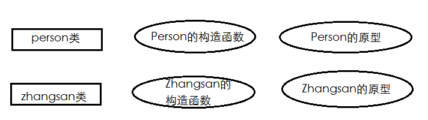
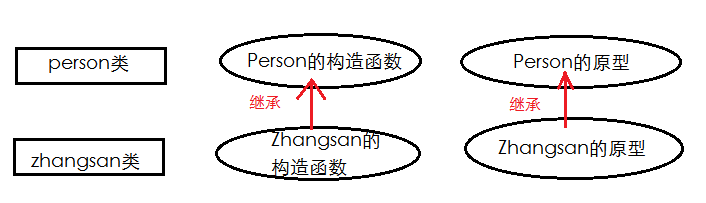

正统的面相对象的语言都会提供extend之类的方法用于出来类的继承，但Javascript并不提供extend方法，在Javascript中使用继承需要用点技巧。

Javascript中的实例的属性和行为是由构造函数和原型两部分组成的，我们定义两个类：Person和zhangsan，它们在内存中的表现如下图1：

如果想让Zhangsan继承Person，那么我们需要把Person构造函数和原型中的属性和行为全部传给Zhangsan的构造函数和原型，如下图2所示：


Are you Ok？了解了继承的思路后，那么我们一步步完成Person和Zhangsan的继承功能。首先，我们需要定义Person类，如下代码：
[代码1]
```js
// 定义Person类
function Person (name){
	this.name = name;
	this.type = "人";
}
Person.prototype={
	say : function(){
		console.info("我是一个"+ this.type +"，我的名字叫" + this.name);
	}
}	
//定义Zhangsan类
function Zhangsan (name){
}
Zhangsan.prototype={
	
}
```
Zhangsan虽然有自己特有的属性和行为，但它大部分属性和行为和Person相同，需要继承自Person类。如前所述，JavaScript中继承是要分别继承构造函数和原型中的属性和行为的。我们先让Zhangsan继承Person的构造函数中的行为和属性，如下代码：
[代码2]
```js
// 定义Person类
function Person (name){
	this.name = name;
	this.type = "黄";
}
Person.prototype={
	say : function(){
		console.info("我是一个"+ this.type +"种人，我的名字叫" + this.name);
	}
}	
//定义Zhangsan类
function Zhangsan (name){
	this.name = name;
	this.type = "黄";
}
Zhangsan.prototype={
}
//实例化Zhangsan对象
var zs = new Zhangsan("张三");
console.info(zs.type);    // 黄
```
运行正常，但我们怎么没看到继承的“味道”呢？我们在Zhangsan的构造函数中将Person的属性和行为复制了一份，与其说是继承不如说是“真巧，这两个类的构造函数除了函数名不同，其他地方都长得一样”。她的缺点很明显：如果Person类的构造函数有任何变动，我们也需要手动的同步修改Zhangsan类的构造函数，同样一份代码，我们复制了一份写在了程序中 的不同地方，这违法了DRY原则，降低了代码的可维护性。

好了，让我们来改进它：
[代码3]
```js
// 定义Person类
function Person (name){
	this.name = name;
	this.type = "黄";
}
Person.prototype={
	say : function(){
		console.info("我是一个"+ this.type +"种人，我的名字叫" + this.name);
	}
}	
// 定义Zhangsan类
function Zhangsan (name){
	Person(name);
}
Zhangsan.prototype={
}
// 实例化Zhangsan对象
var zs = new Zhangsan("张三");
console.info(zs.type);        // undefined
```
我们在Zhangsan的构造函数里调用Person()函数，希望它内部的ths.xxx可以在Zhangsan类的构造函数里执行一遍，但奇怪的是，出现“console.info(zs.type);”时，输出的是undefined，这是怎么回事呢？

这和Person的调用方式有关。在JavaScript中，function有两种不同的调用方法：
1）作为函数存在，直接用“()”调用，例如“function test(){}; test();”test被用作函数，直接被“()”符号调用。
2）作为类的构造函数存在，使用new调用，例如“function test(){}; new test();”test作为类的构造函数，通过new进行test类的实例化。这两种方法的调用，function内部的this指向会有所不同---作为函数的function，其this指向的是window，而作为构造函数的function，其this指向的实例对象。

上面代码中，Zhangsan类构造函数中的Person是通过函数方式调用的，它内部的this指向的是window对象，起效果等同于如下代码：
[代码4]
```js
// 定义Person类
function Person (name){
	this.name = name;
	this.type = "黄";
}
Person.prototype={
	say : function(){
		console.info("我是一个"+ this.type +"种人，我的名字叫" + this.name);
	}
}	
// 定义Zhangsan类
function Zhangsan (name){
	window.name = name;
    window.type = "黄";
}
Zhangsan.prototype={
}
// 实例化Zhangsan对象
var zs = new Zhangsan("张三");
console.info(zs.type);	// undefined
console.info(type);		// 黄 (window.type可以省略写成type)
```
如果想达到[代码3]的效果，让Person内部this指向Zhangsan类的实例，可以通过call或apply方法实现，如下：
[代码5]
```js
// 定义Person类
function Person (name){
	this.name = name;
	this.type = "黄";
}
Person.prototype={
	say : function(){
		console.info("我是一个"+ this.type +"种人，我的名字叫" + this.name);
	}
}	
// 定义Zhangsan类
function Zhangsan (name){
	Person.call(this,name);
}
Zhangsan.prototype={
}
// 实例化Zhangsan对象
var zs = new Zhangsan("张三");
console.info(zs.type);		// 黄
```
构造函数的属性和行为已经成功实现了继承，接下来我们要实现原型中的属性和行为的继承。既然Zhangsan类需要和Person类原型中同样的属性和行为，那么能否将Person类的原型直接传给Zhangsan类的原型，如下代码：
[代码6]
```js
// 定义Person类
function Person (name){
	this.name = name;
	this.type = "黄";
}
Person.prototype={
	say : function(){
		console.info("我是一个"+ this.type +"种人，我的名字叫" + this.name);
	}
}	
// 定义Zhangsan类
function Zhangsan (name){
	Person.call(this,name);
}
Zhangsan.prototype = Person.prototype;
// 实例化Zhangsan对象
var zs = new Zhangsan("张三");
// 我是一个黄种人，我的名字叫张三
zs.say();
```
通过Person类的原型传给Zhangsan类的原型，Zhangsan类成功获得了say行为，但事情并不像想象中的那么简单，如果我们要给Zhangsan类添加run行为呢？如下代码：
[代码7：添加run行为]
```js
// 定义Person类
function Person (name){
	this.name = name;
	this.type = "黄";
}
Person.prototype={
	say : function(){
		console.info("我是一个"+ this.type +"种人，我的名字叫" + this.name);
	}
}	
// 定义Zhangsan类
function Zhangsan (name){
	Person.call(this,name);
}
Zhangsan.prototype = Person.prototype;
Zhangsan.prototype.run = function(){
	console.info("我100米短跑只要10秒！");
}
// 实例化Zhangsan对象
var zs = new Zhangsan("张三");
zs.say();   // 我是一个黄种人，我的名字叫张三
zs.run();   //我100米短跑只要10秒！
var zs2 = new Person("张三2");
zs2.run();	//我100米短跑只要10秒！
```
我们只想给Zhangsan类添加run行为，为什么Person类也获得了run行为了呢？这涉及传值和传址的两个问题----在JavaScript中，赋值语句会用传值和传地址两种不同的方式进行赋值，如果是数值型、不尔型、字符型等基本数据类型，在进行赋值时会将数据直接赋值一份，将赋值的那一份数据进行赋值，也就是通常所说的传值；如果是数组、hash对象等复杂数据类型，在进行赋值时会直接用内存地址赋值，而不是将数据赋值一份，这就是传址赋值，就是传数据的映射地址。
[代码8：传值与传址]
```js
var a=10;		// 基本数据类型
var b=a;		// 将变量a保存的值赋值一份，传给变量b，b和a各保存一份数据
var c=[1,2,3];	// 复杂数据类型
var d=c;		// 将变量c指向的数据内存地址传给变量d，c和d指向同一份数据
b++;
d.push(4);
console.info(a);	// 10
console.info(b);	// 11		变量b保存的数据更改不会影响到变量a
console.info(c);	// 1,2,3,4	变量c和d指向同一份数据，数据更改会相互影响
console.info(d);	// 1,2,3,4
```
在原生JavaScript中，选择传值还是传地址是根据数据类型来自动判断的，但传地址有时候会给我们带来意想不到的麻烦，所以我们需要对复杂数据类型的赋值进行控制，让复杂数据类型也可以进行传值。

最简单的做法是遍历数组或者Hash对象，将数组或者Hash对象这种复杂的数据拆分成一个个简单数据，然后分别赋值，如下面代码：
[代码9：对复杂数据类型进行传值]
```js
var a = [1, 2, 3] ,b = {name:'张三',sex:'男',tel:'1383838438'};
var c = [] ,d = {};
for(var p in a){
	c[p] = a[p]; 
}
for(var p in b){
	d[p] = b[p];
}
c.push('4');
d.email = 'ibing@outlook.com';
console.info(a);			// [1, 2, 3]
console.info(c);            // [1, 2, 3, "4"]
console.info(b.email);		// undefined
console.info(d.email);		// ibing@outlook.com
```
值得一提的是，对于数组的传值还可以使用数组类的slice或者concat方法实现，如下面代码：
[代码10：数组传值的简单方法]
```js
var a = [1, 2, 3];
var b = a.slice(), c = a.concat();
b.pop();
c.push(4);
console.info(a);		// [1, 2, 3]
console.info(b);        // [1, 2]
console.info(c);		// [1, 2, 3, 4]
```
prototype本质上也是一个hash对象，所以直接用它赋值时会进行传址，这也是为什么[代码7：添加润行为]中，zs2居然会run的原因。我们可以用for in来遍历prototype，从而实现prototype的传值。但因为prototype和function（用做类的function）的关系，我们还有另外一种方法实现prototype的传值----new SomeFunction()，如下面代码：
[代码11]
```js
// 定义Person类
function Person (name){
	this.name = name;
	this.type = "黄";
}
Person.prototype={
	say : function(){
		console.info("我是一个"+ this.type +"种人，我的名字叫" + this.name);
	}
}	
// 定义Zhangsan类
function Zhangsan (name){
	Person.call(this,name);
}
Zhangsan.prototype = new Person();
Zhangsan.prototype.constructor = Person;
Zhangsan.prototype.run = function(){
	console.info("我100米短跑只要10秒！");
}
	
// 实例化Zhangsan对象
var zs = new Zhangsan("张三");
zs.say();   // 我是一个黄种人，我的名字叫张三
zs.run();   // 我100米短跑只要10秒！
var zs2 = new Person("张三2");
zs2.run();	// TypeError: zs2.run is not a function
```
您是否注意到上面这句Zhangsan.prototype.constructor = Person;，这是因为Zhangsan.prototype = new Person();时，Zhangsan.prototype.constructor指向了Person，我们需要将它纠正，重新指向Zhangsan。