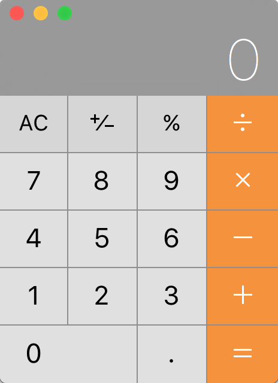
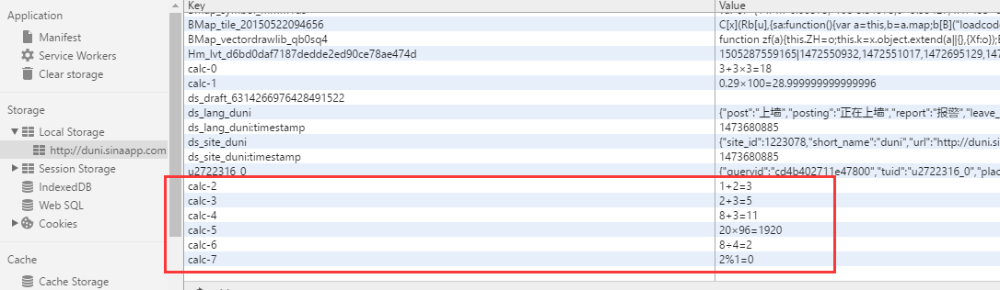

# 一道笔试题

之前偶然看到一个公司的笔试题，题目如下：
用HTML5、CSS3、JavaScript，做一个网页，实现如下图形式计算器

 
具体要求：

1. 有且只有一个文件：index.html。不允许再有其他文件，不允许再有单独的CSS、JS、PNG、JPG文件。  
2. 运行环境为 Google Chrome。  
3. 必须支持标准的四则运算。例如：1+2*3=7。  
4. 请在收到邮件的48小时内独立完成本测试，并回复本邮件。  

# 一道笔试题引发的一个练手项目

花了一点时间写好的第一版，符合了笔试题的要求。后来左看右看觉得还可以改进做的更好，于是给它不断的改进，加新功能等，这样下来没完没了，利用业余时间一点一点的写，从刚开始的网页版，到后来做响应式的移动版，再到现在的移动App，短短续续大概写了3个月吧。

## 项目地址

最终版的计算器，项目地址和预览图片在GitHub：[
https://github.com/dunizb/sCalc](https://github.com/dunizb/sCalc)

## 功能说明

最终版的功能如下：  
1. 界面布局采用CSS3 的 Flex box布局  
2. 内置两套主题可切换  
3. 计算历史记录显示  
4. 左滑右滑可以切换单手模式(App)  
5. 当输入手机号码后长按等于号可以拨打手机号码(App)  
6. 版本更新检查(App)  

**界面布局**

由于这个项目只是练手,所以采用了HTML5个CSS3技术，也不打算兼容IE等低版本浏览器，所以直接使用CSS3提供的Flexbox布局方式。并且使用rem单位来进行自动计算尺寸。

计算计算历史记录显示功能，使用HTML5提供的本地存储功能之Local Storage，为了方便使用Local Storage，对它进行了简单的封装（见`js/common.js`文件）使之key值按一定规律生产，方便管理。



key由appName+id组成，id是自动增长不重复的，可以按id和appName删除一条记录，输入`*`则全部删除。

**打包APP**

移动Web版计算器写完后，又想把他做成APP在手机上运行，由于本人没用过混合APP诸如ionic之类的框架，所以参考了一下，选择了Hbuild来进行开发和APP的打包，非常方便。（[HBuild](http://www.dcloud.io/index.html)）.

**单手模式**

左滑右滑可以切换单手模式，这就需要移动端的touch事件了，使用如下代码判断是左滑还是又滑：
```
/** 单手模式 */
function singleModel(){
    var calc = document.getElementById("calc");
    var startX = 0,moveX = 0,distanceX = 0;
    var distance = 100;  
    var width = calc.offsetWidth;
    //滑动事件
    calc.addEventListener("touchstart",function(e){
        startX = e.touches[0].clientX;
    });
    calc.addEventListener("touchmove",function(e){
        moveX = e.touches[0].clientX;
        distanceX = moveX - startX;
        isMove = true;
    });
    window.addEventListener("touchend",function(e){
        if(Math.abs(distanceX) > width/3 && isMove){
            if( distanceX > 0 ){
                positionFun("right");        //右滑
            }else{
                positionFun("left");          //作滑
            }
        }
        startY = moveY = 0;
        isMove = false;
    });   
}
```
如果是坐滑，就`position:absolut;left:0,bottom:0`，再把最外层DIV缩小到80%，这样就实现了左滑计算器缩小移动到左下角。右滑道理一样。

**电话拨打功能**

当输入手机号码后长按等于号可以拨打手机号码。这个功能没什么神奇，在移动Web上会对那些看起来像是电话号码的数字处理为电话链接，比如：

+ 7位数字，形如：1234567
+ 带括号及加号的数字，形如：(+86)123456789
+ 双连接线的数字，形如：00-00-00111
+ 11位数字，形如：13800138000

可能还有其他类型的数字也会被识别。我们可以通过如下的meta来开启电话号码的自动识别：
```
<meta name="format-detection" content="telephone=yes" />
```
开启电话功能
```
<a href="tel:123456">123456</a>
```
开启短信功能：
```
<a href="sms:123456">123456</a> 
```

但是，在Android系统上，只能调用系统的拨号界面，在iOS上则能调过这一步直接把电话拨打出去。

**版本更新检查**

在关于页面，有一个版本更新检查按钮，就能检查是否有新版本，这个功能的原理是发送一个JSOPN请求去检查服务器上的JSON文件，比对版本号，如果服务器上的版本比APP的版本高则会提示有新版本可以下载。\

客户端JavaScript代码：
```
function updateApp(){
    //检查新版本
    var updateApp = document.getElementById("updateApp");
    updateApp.onclick = function(){
        var _this = this;
        $.ajax({
            type:'get',
            url:'http://duni.sinaapp.com/demo/app.php?jsoncallback=?',
            dataType:'jsonp',
            beforeSend : function(){
                _this.innerHTML = "<i class='iconfont updateAppIcon updateAppIconRotate'></i> 正在检查新版本...";
            },
            success:function(data){
                var newVer = data[0].version;
                if(newVer > appConfig.version){
                    var log = data[0].log;
                    var downloadUrl = data[0].downloadUrl;
                    if(confirm("检查到新版本【"+newVer+"】，是否立即下载？\n 更新日志：\n " + log)){
                        var a = document.getElementById("telPhone");
                        a.href = downloadUrl;
                        a.target = "_blank";
                        a.click();
                    }
                }else{
                    alert("你很潮哦，当前已经是最新版本！");
                }
                _this.innerHTML = "<i class='iconfont updateAppIcon'></i> 检查新版本";
            },
            error:function(msg){
                _this.innerHTML = "<i class='iconfont updateAppIcon'></i> 检查新版本";
                alert("检查失败："+msg.message);
            }
        });
    }
}
```
服务端JSON：
```
[
    {
        "version":"3.1.0",
        "downloadUrl":"http://dunizb.b0.upaiyun.com/demo/app/myCalc-3.1.0.apk",
        "hashCode":"20160812224616",
        "log":"1.新增切换主题功能 \n 2.新增单手切换模式功能 \n 3.调整UI "
    }
]
```

# 下个版本计划

当前3.1.0版本还存在一些问题：  
1. 由于JS本身存在计算浮点数精度丢失问题，所以这个问题在项目中同意存在，需要自己去处理这个问题  
2. 由于使用了第三方的天气接口，用了jquery.Ajax方法，所以违背了使用纯原生写的初衷。  

所以下个版本的开发计划为：  
1. 解决浮点数计算精度问题  
2. 把获取天气信息的jquery.Ajax方法替换为原生JavaScript代码，自己封装JSONP请求函数  
3. 使用面向对象方式重构APP  

欢迎大家到github上来看看，如果喜欢可以star、watch一下，或提issue。