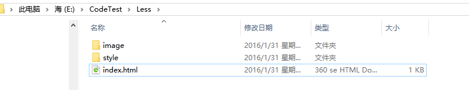
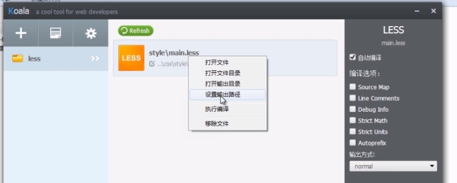
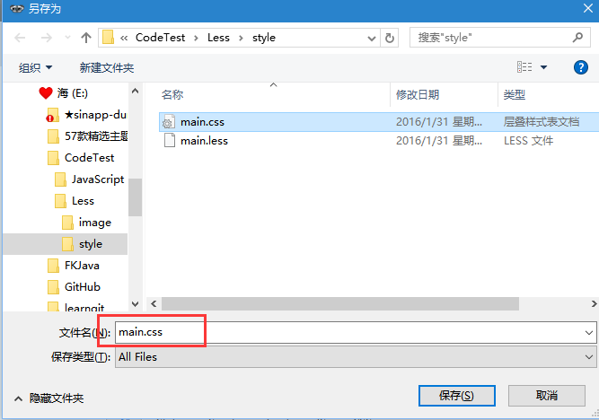
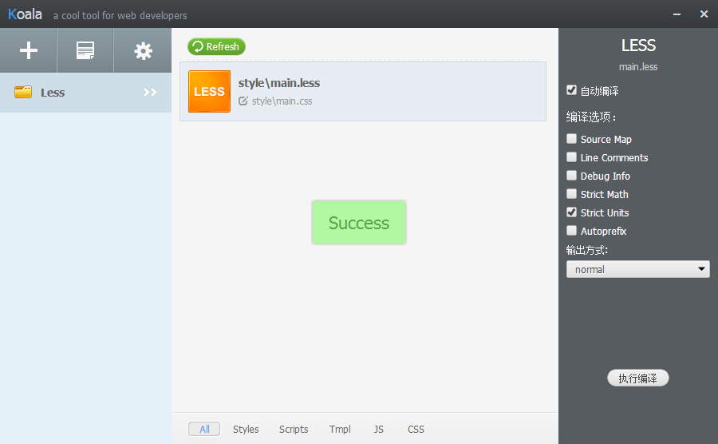
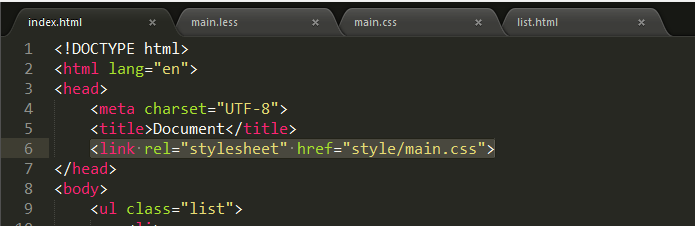

1、Less是什么？
======================

Less类似于jQuery
- LESCSS使用这个动态样式语言，属于CSS预处理语言的一种，它使用类似CSS的语法，为CSS赋予了动态语言的特性，如变量、继承、运算、函数等，更方便CSS的编写和维护。
- LESSCSS可以在多种语言、环境中使用，包括浏览器端、桌面客户端、服务端。

2、编译工具
======================
+ Koala编译
 - 国人开发的LESS\SASS编译工具
 - 下载地址：http://koala-app.com/index-zh.html
+ Node.js库
+ 浏览器端使用

3、Koala的使用
======================
1. 下载安装后，打开设置，更换语言为简体中文，然后重启。

2. 新建Less项目目录如下：


3. 在style文件夹下新建main.less文件，推荐使用用Sublime Text，打开main.less

4. 把Less目录拖到Koala中，点击右键设置输出目录：
   
输出到style/main.css中：  
    
实际上是通Koala把main.less编译成css然后写入到mian.css文件中。

5. 编译less  
点击文件展示功能选择，选择自动编译，然后点击执行编译按钮，如果成功会提示Success。  

输出方式的compress是压缩后的代码，我们开发、学习阶段可以使用默认的normal方式。

6. 在HTML文件中引用css
打开index.html，link引用  


7. 测试  
我们在main.less中写less代码，保存后就自动编译到了main.css文件中。

4.LEES语法
=============================
1 注释
--------------------------------------
+ 可以使用CSS中的注释 （```/*我会被编译*/```）
+ 也可以使用```//我不会被编译```注释。这个注释在编译时自动过滤掉

2 变量
--------------------------------------
Less中声明变量一定要用@开头，比如：@变量名:值
```css
//1.声明变量
@test_width:300px;
.box{
   //2.使用变量
   width: @test_width;
   height: @test_width;
   border: 1px solid white;
   background-color: yellow;
}

```
它编译后的css文件中@test_width就直接替换为300px;了。

3 混合 - （Mixin）
--------------------------------------
+ 混合（mixin）变量
 - 例如：.border{border:solid 10px red;}
+ 带参数的混合
 - .border-radius(@radius){css代码}
  - 可设定默认值
  - border-radius(@radius:5px){css代码}

Less：
```css

@test_width:300px;
.box{
     //2.使用变量
     width: @test_width;
     height: @test_width;
     background-color: yellow;

     .border;
}

//混合
.border{
 border: 5px solid pink;
}

.box2{
     .box;
     margin-left: 100px;
}
```
生成后的CSS：
```css
.box {
     width: 300px;
     height: 300px;
     background-color: yellow;
     border: 5px solid pink;
}
.border {
    border: 5px solid pink;
}
.box2 {
    width: 300px;
    height: 300px;
    background-color: yellow;
    border: 5px solid pink;
    margin-left: 100px;
}
```
带参数的混合，Less：
```css
//混合 - 可带参数的
.border_02(@border_width){
     border: solid yellow @border_width;
}

.test_hunhe{
     .border_02(30px);
}
```
带默认值参数的混合，Less：
```css
.border_03(@border_width:10px){
     border: solid green @border_width;
}
.text_hunhe_03{
     .border_03();
}
```
在引用.border_03的时候没有传递至，那么默认的值就是10px。

4 匹配模式
--------------------------------------
+ 相当于JS中的if，但不完全是
+ 满足条件后才能匹配

我们来看一个画三角的例子，如果你知道怎么画更好：
HTML：
```html
<div class="sanjiao"></div>
```
Less：
```css
.sanjiao{
     width: 0;
     height: 0;
     overflow: hidden;
     border-width: 10px;
     border-color: transparent transparent red transparent;
     border-style: dashed dashed solid dashed;
}
```
这是画一个向上的三角，如果我们要改变三角的朝向，我们得改变border-color，我们得写几遍大部分都一样的代码，而用来模式匹配之后：
Less：
```css
//模式匹配
.triangle(top,@width:5px,@color:#ccc){
     border-width: @width;
     border-color: transparent transparent @color transparent;
     border-style: dashed dashed solid dashed;
}
.triangle(bottom,@width:5px,@color:#ccc){
     border-width: @width;
     border-color: @color transparent transparent transparent;
     border-style: dashed dashed solid dashed;
}
.triangle(left,@width:5px,@color:#ccc){
     border-width: @width;
     border-color: transparent @color transparent transparent;
     border-style: dashed solid dashed dashed;
}
.triangle(right,@width:5px,@color:#ccc){
     border-width: @width;
     border-color: transparent transparent transparent @color;
     border-style: dashed dashed dashed solid;
}
```
然后我们需要什么方向调用的时候就传什么方向：
```css
.sanjiao{
     width: 0;
     height: 0;
     overflow: hidden;
     .triangle(right,100px);
}
```
但是，里面的width、heiht又要重写一遍，而Less给我们提供了一个东西，它不管你如何选择什么三角方向，它总会带上那个东西，有点像Java里面的finally块，无论你try块里做了什么，Java始终会执行finally块里的代码，好了，我们来看下Less班的finally如何写：
```css
.triangle(@_,@width:5px,@color:#ccc){
     width: 0;
     height: 0;
     overflow: hidden;
}
.sanjiao{
     .triangle(right,100px);
}
```
发现了没？就是一个“@_”参数！无论你选择top是right方向，带@_参数的triangle都会被带上，调用的时候就没必要再写width，height等。

如果你觉得上面比较复杂了一点，OK，我们来一个简单的例子，div定位的例子
HTML：
```html
<div class="pipei"></div>
```
写三个定位，相对定位、绝对定位和固定定位
Less：
```css
//匹配模式 - 定位
.post(r){
     position: relative;
}
.post(a){
     position: absolute;
}
.post(f){
     position: fixed;
}

.pipei{
     width: 200px;
     height: 200px;
     background-color: green;
     .post(r);
}
```
这样，这个div就是相对定位了。

5 运算
--------------------------------------
在Less中，任何数组、颜色或者变量都可以参与运算，运算应该被包裹在括号中。例如：+ - * /
给宽度增加20px然后在乘以5个像素，Less：
```css
@test_01:300px;

.box_02{
 width: (@test_01 + 20) * 5;
}
```

6 嵌套规则
--------------------------------------
Less中的嵌套是最有意思的小东西了、我们创建这个一个列表：
```html
<ul class="list">
   <li>
       <a href="#">Less的嵌套用法</a>
       <a href="#">Less的嵌套用法</a>
       <a href="#">Less的嵌套用法</a>
       <a href="#">Less的嵌套用法</a>
       <a href="#">Less的嵌套用法</a>
   </li>
 </ul>
```
Less：
```css
.list{
   width: 600px;
   margin: 30px auto;
   padding: 0;
   list-style: none;
 
   li{
       height: 30px;
       line-height: 30px;
       background-color: pink;
       margin-bottom: 5px;
       padding: 0 10px;
   }
   a{
       float: left;
       //& 代表它的上一层选择器
       &:hover{
             color: red;
       }
   }
   span{
         float: right;
   }
}
```
它编译后生成的CSS就是这样的：
```css
.list {
    width: 600px;
    margin: 30px auto;
    padding: 0;
    list-style: none;
}
.list li {
    height: 30px;
    line-height: 30px;
    background-color: pink;
    margin-bottom: 5px;
    padding: 0 10px;
}
.list a {
    float: left;
}
.list a:hover {
    color: red;
}
.list span {
    float: right;
}
```

7 @arguments变量
--------------------------------------
@arguments包含了所有传递进来的参数。如果你不想单独处理每一个参数的话就可以像这样写：
Less：
```css
.border_arg(@w:30px,@c:red,@xx:solid){
   border: @arguments;
}
.test_arguments{
   .border_arg();
}
```
这样@arguments就自动帮我们注入了所有的参数，省了那么一丢丢的代码。

8 避免编译、!important以及总结
--------------------------------------
**避免编译**
+ 有时候我们不需要输出一些不正确的CSS语法或使用一些Less不认识的专有语法。
+ 要输出这样的值，我们可以在字符串前加一个~，例如：width:~'clac(100% - 35)'

Less：
```css
.test_03 {
    width: calc(200px - 30px);
}
```
这样的话，编译后的CSS就自动帮你计算了
CSS：
```css
.test_03 {
    width: calc(170px);
}
```
但我们并不想它在编译时被计算，而是想让浏览器去计算，这时候我们就需要添加~符号了：
```css
.test_03{
     width: ~'calc(200px - 30px)';
}
```
这样，就可以避免编译，输出的CSS就是这样（原样输出）
```css
.test_03 {
      width: calc(200px - 30px);
}
```
**!important关键字**
会为所有混合所带来的样式，添加!important

更多语法和文档请访问LESS中文网站：
+ http://www.bootcss.com/p/lesscss/
+ http://www.1024i.com/demo/less/index.html
