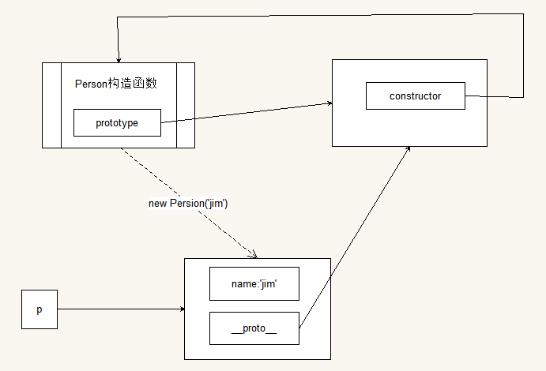

# 一、原型

一句话说明什么是原型：原型能存储我们的方法，构造函数创建出来的实例对象能够引用原型中的方法。

## 1.1 JS的对象比较

由于JS是解析执行的语言，那么在代码中出现函数与对象如果重复执行，会创建多个副本。

1. 在代码中重复执行的代码容易出现重复的对象
2. 传统的构造函数定义方式会影响性能
3. 可以考虑将方法全部放到外面但是会有安全问题
    - 在开发中会引入各种框架和库，自定义的成员越多，出现命名冲突的几率越大
    - 在开发中可能会有多个构造函数，每一个构造函数应该有多个方法，那么就会变得不容易维护。
4. 任意一个对象都会默认的链接到它的原型中    
    - 创建一个函数，会附带的创建一个特殊的对象，该对象使用函数`.prototype`引用。称其为函数的**原型属性**
    - 每一个由该函数作为构造函数创建的对象，都会默认的连接到该对象上
    - 在该对象访问某一个方法或属性时的时候，如果该对象中没有，就会到这个原型中去查找。
    
## 1.2 传统构造函数的问题

```
function Foo(){
    this.sayHello = function(){
     }
}
```

- 由于对象是调用`new Foo()`所创建出来的，因此每一个对象在创建的时候，函数sayHello都会呗创建一次
- 那么没一个对象都含有一个独立的，不同的，但是功能逻辑一样的函数，比如：`{} == {}`
- 在代码中方法就会消耗性能，最典型的资源就越是内存
- 这里最好的方法就是将函数放在构造函数之外，那么在构造函数中引用该函数即可    

```
function sayHello () {}
function Foo () {
    this.say = sayHello；
}  
```

- 会在开发中变得困难：引入框架危险，代码繁冗不好维护。解决方法就是如果外面的函数不占用其名字，而且在函数名下
- 每一个函数在定义的时候，有一个神秘对象（即原型）被创建出来。
- 每一个由构造函数创建的对象都会默认的连接到该神秘对象上。

```
var f1 = new Foo();
var f2 = new Foo();
f1.sayHello();    //如果f1没有sayHello那么就会在Foo.prototype中去找
```

- 由构造函数创建出来的众多对象共享一个对象就是构造函数.prototype
- 只需要将共享的东西，重复会多占用内存的东西放到构造函数.prototype中，那么所有的对象就可以共享了。

```
function Foo(){}
Foo.prototype.sayHello = function(){
    console.log("....");
}
var f1 = new Foo();
f1.sayHello();
var f2 = new Foo();
f2.sayHello();
console.log(f1.sayHello === f2.sayHello);
```

下面写一个构造函数 Student, 有 name, age, gender, sayHello, study. 构造函数带参数.

```
var Student = function(name,age,gender){
    this.name = name;
    this.age = age;
    this.gender = gender;
}
Student.prototype.sayHello = function(){
    return "你好，我是："+this.name;
}
Student.prototype.study = function(){
    return "我正在学习JavaScript";
}
var stu1 = new Student("zhangsan",19,"man");
console.log(stu1);
console.log(stu1.sayHello());
var stu2 = new Student("李四",20,"woman");
console.log(stu2);
console.log(stu2.study());
```

## 1.3 常见错误

写 构造函数`.prototype` 的时候, 将属性也加到里面.

```
function Person() {}
Person.prototype.name = '张三';
var p = new Person();
```

赋值的错误

```
function Person() {}
Person.prototype.name = '张三';
var p1 = new Person();
var p2 = new Person();
p1.name = '李四';
console.log( p1.name );
console.log( p2.name );
// 如果是访问数据, 当前对象中如果没有该数据就到构造函数的原型属性中去找
// 如果是写数据, 当对象中有该数据的时候, 就是修改值; 如果对象没有该数据, 那么就添加值
```

## 1.4 原型相关的概念

### 1.4.1 关于面向对象的概念

- 类class：在JS中就是构造函数
    + 在传统的面向对象语言中，使用一个叫类的东西定义模板，然后使用模板创建对象。
    + 在构造方法中也具有类似的功能，因此也称其为类
- 实例（instance）与对象（object）
    + 实例一般是指某一个构造函数创建出来的对象，我们称为XXXX 构造函数的实例
    + 实例就是对象。对象是一个泛称
    + 实例与对象是一个近义词
- 键值对与属性和方法
    + 在JS中键值对的集合称为对象
    + 如果值为数据（非函数），就称该键值对为属性
    + 如果值为函数（方法），就称该键值对为方法method
    + 父类与子类（基类和派生类）
    + 传统的面向对象语言中使用类来实现继承那么就有父类、子类的概念
    + 父类又称为基类，子类又称为派生类
    + 在JS中没有类的概念，在JS中常常称为父对象，子对象，基对象，派生对象。
	
### 1.4.2 原型相关的概念

- 原型对象针对构造函数称为原型属性
    + 神秘对象就是构造函数的原型属性，简称**原型**
- 原型对象与构造函数创造出来的对象也有一定的关系：
    + 原型针对构造函数创建出来的对象称为原型对象，简称原型
    + 对象继承自其原型
    + 构造函数创建的对象 继承自 构造函数的原型属性
    + 构造函数创建的对象 继承自 该对象的原型对象
    + 构造函数所创建出来的对象与构造函数的原型属性表示的对象是两个不同的对象    
	+ 原型中的成员，可以直接被实例对象所使用
	+ 也就是说实例对象直接含有原型中的成员
	+ 因此实例对象继承自原型
	+ 这样的继承就是原型继承
	
## 1.5 如何使用原型

为什么要使用原型？——提高函数的复用性。 
为什么属性不放在原型上而方法要放在原型上？

1. 利用对象的动态特性
    - 构造函数.prototype.xxxx = vvv;
2. 利用直接替换

```
Student.prototype = {
    sayHello : function(){},
    study : function(){}
};
```

## 1.6 ——proto——

以前要访问原型，必须使用构造函数来实现，无法直接使用实例对象来访问原型。   
火狐最早引入属性`__proto__`表示使用实例对象引用原型。但是早期是非标准的。   
通过该属性可以允许使用实例对象直接访问原型。

```
function Person() {}
// 神秘对象就是Person.prototype
//那么只有使用构造函数才可以访问它
var o = new Person();
//以前不能直接使用o来访问神秘对象
//现在有了__proto__后，
o.__proto__也可以直接访问神秘对象
//那么o.__proto__ === Person.prototype
```

1. 神秘对象（原型）中都有一个属性`constructor`，翻译为 构造器 。表示该原型是与什么构造函数联系起来的。
2. `__proto__`有什么用?
    * 可以访问原型
    * 由于在开发中除非特殊要求，不要使用实例去修改原型的成员，因此该属性开发时使用较少。
    * 但是在调试过程中非常方便，可以轻易的访问原型进行查看成员
3. 如果在早期的浏览器中使用实例需要访问原型如何处理？
    * 可以使用实例对象访问构造器，然后使用构造器访问原型
   ```
   var o = new Person();
   o.constructor.prototype
   ```
4. 如果给实例继承自原型的属性赋值
    ```
    function Foo();
    Foo.prototype.name = "test";
    var o1 = new Foo();
    var o2 = new Foo();
    o1.name = "张三";    // 不是修改原型中的name而是自己增加了一个name属性
    console.log(o1.name + '，'+ o2.name);    // 张三，test
    ```

# 二、继承

1. 最简单的继承就是将别的对象的属性强加到我身上，那么我就有这个成员了。
2. 利用原型也可以实现继承，不需要在我身上添加任何成员，只要原型有了我就有了。

**结论**
将属性，方法等成员利用混入的办法，加到构造器函数的原型上，那么构造器函数的实例就具有该方法了。

## 2.1 混合式继承的简单描述

```
var Person = function () {};
var extend = function ( o1, o2 ) {
      for ( var k in o2 ) {
           o1[ k ] = o2[ k ];
      }
};
 
extend( Person.prototype, {
     run: function () { console.log( '我能跑了' ); },
     eat: function () { console.log( '我可以吃了' ); },
     sayHello: function () { console.log( '我吃饱了' ); }
});
```
改良
```
var Person = function () {};
Person.prototype.extend = function ( o ) {
     for ( var k in o ) {
          this[ k ] = o[ k ];
     }
};
 
Person.prototype.extend({
      run: function () { console.log( '我能跑了' ); },
      eat: function () { console.log( '我可以吃了' ); },
      sayHello: function () { console.log( '我吃饱了' ); }
});
```

## 2.2 细节

使用点语法给原型添加成员与直接替换修改原型对象有什么区别？
1. 原型指向发生了变化
2. 构造函数所创建的对象所继承的原型不同
3. 新增的对象默认是没有`constructor`属性

注意：在使用替换方式修改原型的时候，一般都会添加constructor属性。
```
function Person() {}
Person.prototype = {
    constructor: Person
};

// 拆解
function Person() {}
var o = {};
o.constructor = Person;    // 属性中就存储着函数的地址

Person.prototype = o;

Person = 123;
```

## 2.3 静态成员与实例成员的概念

也是从面向对象的语言中引入的
1. 静态成员表示的是 静态方法和静态属性的概念，所谓的静态，就是由构造函数所提供的。
2. 实例成员表示的是 实例方法 和 实例属性，所谓实例就是由构造函数所创建的对象。

一般工具型方法都有静态成员提供，一般与实例对象有关的方法有实例成员表示。

### 2.4 构造、原型、实例三角结构图

