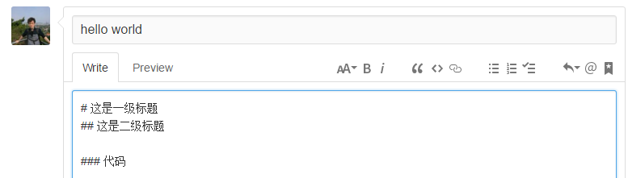
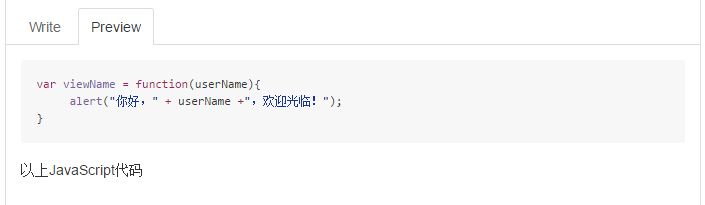
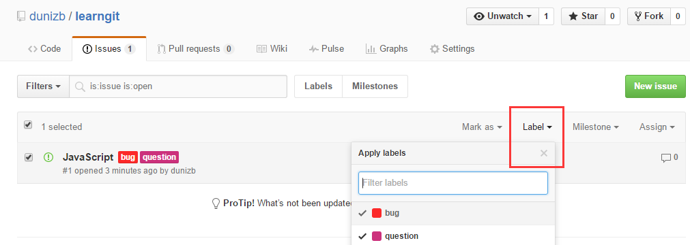
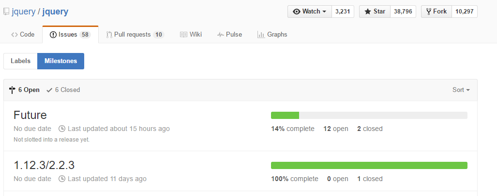
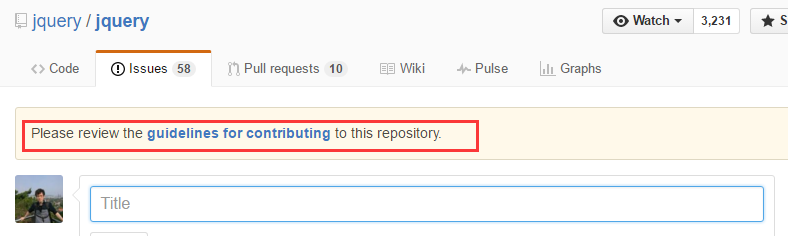
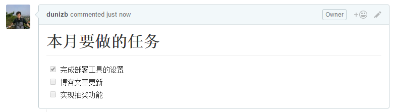

在软件开发过程中，开发者们为了跟踪BUG及进行软件相关讨论，进而方便管理，创建了Issue。管理Issue的系统称为BTS（Bug Tracking System，Bug跟踪系统）。当今具有代表性的BTS有[Redmine](http://www.redmine.org/)、[Trac](http://trac.edgewall.org/)、[BugZilla](https://www.bugzilla.org/)等。

GitHub自身也加入了BTS的功能。在GitHub上，可以将它作为软件开发者之间的交流工具，多多加以利用。遇到下面几种情况时，各位就可以使用这个功能。
+ 发现软件的BUG并报告
+ 有事想向作者询问、探讨
+ 事先列出今后准备实施的任务

Issue除BUG管理之外还有许多其他用途。在软件开发者圈子中，将Issue用于多种用途的情况已经司空见惯。作为GitHub的功能之一，我们来学习Issue的一些简单用法。

简洁且表现力丰富的描述方法
=================================
GitHub的Issue及评论可以使用GFM（Github Flavored Markdown）语法进行描述，从而获得丰富的表现力。比如像下图1那样描述，然后点击Preview，就可以看到图2中那种标记后的效果。


注意：“#”和后面的文字之间要有一个空格，否则无效


在文本框的下面可以找到GFM语法样式相关帮助的链接


###1. 语法高亮

假设我们像下面这样，先指定语言再描述代码。
```js
var viewName = function(userName){
 alert("你好，" + userName +"，欢迎光临！");
}
```
以上JavaScript代码
这样一来，代码就会自动如图3所示被添加语法高亮，变得直观易读。


###2. 添加图片

添加图片也十分简单，只需要将图片拖拽到文本框中便可以粘贴图片。

###3. 添加标签以便整理

Issue可以通过添加标签（Label）来进行整理。添加标签后，Issue的标题后面就会显示标签（图4）。点击标签，还可以只显示该类标签的Issue，GitHub默认给我们设定了几个标签类型。


###4. 添加里程碑以便管理

处标签外，还可以通告添加里程碑来管理Issue。通过图5可以看出，项目距离下一个版本还有12个Issue需要实施，整体的14%已经实施完毕并Close。从这里的链接我们可以看出剩余的Issue。


注意：在添加Issue时常会看到图5中这种贡献规范的链接。改仓库的根目录下添加CONTRIBUTING.md文件后该链接就会显示出来。


规范的内容一般包括报告时Issue的描述方法、Pull Request时的规则或要求、许可证的相关信息等。为了在开源项目开发中能与其他人和谐相处，请务必在贡献之前仔细阅读这些规则。

###5. Tasklist语法

我们使用GFM的一项独有功能，那就是Tasklist(任务列表)语法。首先试着按下面的格式进行描述。
```
# 本月要做的任务
- [x] 完成部署工具的设置
- [ ] 博客文章更新
- [ ] 实现抽奖功能
```
这样一来，这段文字就会呗标记成复选框列表的样式。这个复选框列表可以直接勾选或者取消，不必打开Issue的编辑页面重新编辑，十分方便。


通过提交信息操作Issue
================================
在GitHub上，只要按照特定的格式描述提交信息，就可以像一般BTS带有的功能那样对Issue进行操作。

###Close Issue

如果一个处于Open状态的Issue已经处理完毕，只要在该提交中以下列任意一种格式描述提交信息，对应的Issue就会被Close。
+ fix #24
+ fixes #24
+ fixed #24
+ close #24
+ closes #24
+ closed #24
+ resolve #24
+ resolves #24
+ resolved #24

利用这个方法，每次提交并Push之后，就不必再大费周章地到GitHub的Issue中寻找相应的Issue手动Close，省去了不少麻烦。像这样，只要按照特定的格式描述提交信息，Github就会自动识别并处理，很多GitHub之外的BTS也实现了这一功能。