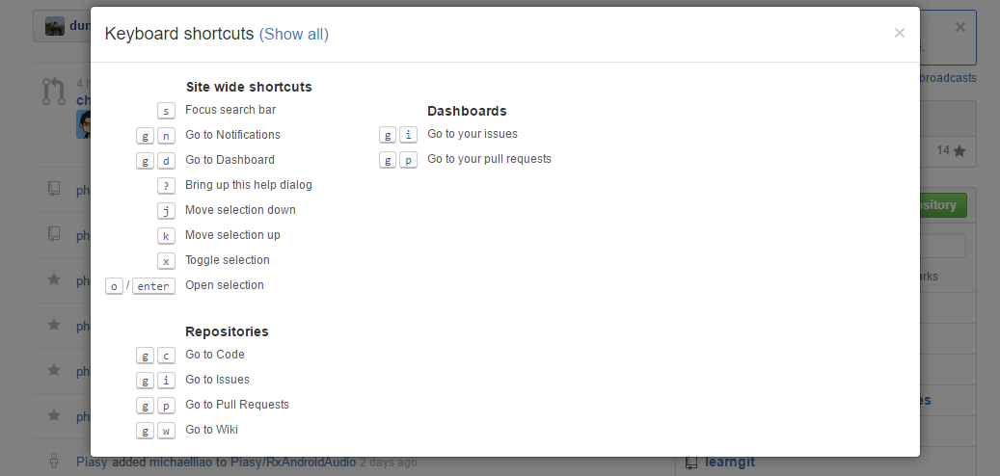
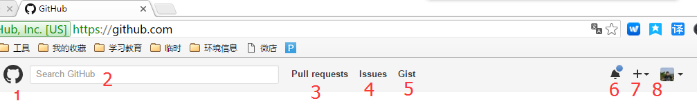
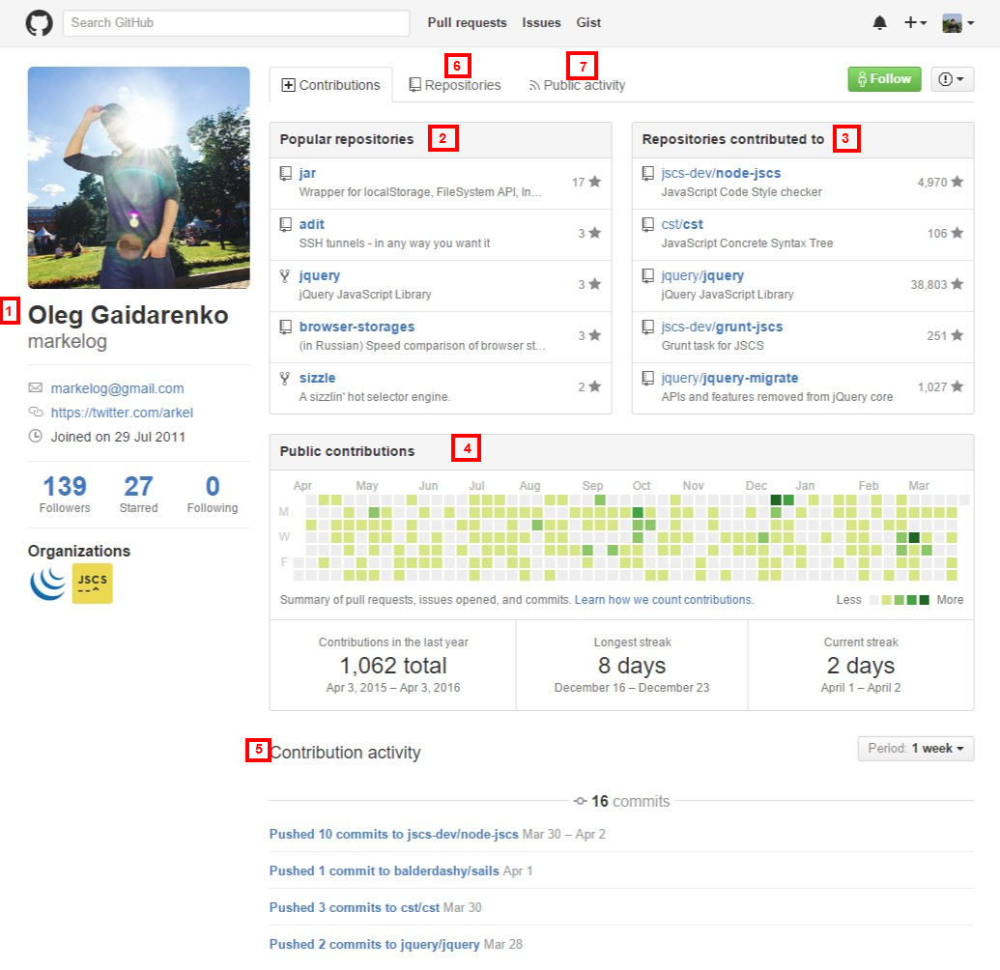

GitHub初学入门者的图谱，介绍Github网站每个功能的意思

一、键盘快捷键
=============================
在GitHub中，很多页面都可以使用键盘快捷键。在各个页面按下“shift + /”都可以打开键盘快捷键一览表，如下图：

二、工具栏
============================

1. LOGO
点击GitHub的LOGO就会进入控制面板。
2. Search（搜索）
在这里输入想要找的用户或代码片段，就可以搜索到与之相关的信息
3. Pull Request（请求）
显示用户已经进行过Pull Request。通过这里，开发者可以很方便地追踪Pull Request的后续情况。
4. Issue（问题）
在这里可以查看用户拥有权限的仓库或分配给自己的Issue。当用户同时进行多个项目时，可以在这里一并查看Issue。
5. Gist（代码片段）
Gist功能主要时用于管理及发布一些没必要保存在仓库中的代码，比如小代码片段等。系统会自动管理更新历史，并且提供了Fork功能。在Gist上添加代码示例可以嵌入博客中，当然，如果选择了语言，还会自动添加语法高亮。
6. Notifications（通知）
这一图标用于提示用户是否有更新的通知。
7. Create a new...
创建新的Git仓库或Organization，向Organization（组织）添加成员、小组、仓库，为仓库添加Issue或collaborator（合作者）等操作的菜单都聚集在这里。显示的内容会根据当前页面的不同而改变。
头像、用户名

三、个人信息页
==================================

1. 用户信息
显示注册的基本信息，包括姓名、所属公司、邮箱地址、已加入的Organization（组织）等，如果对该用户感兴趣，可以点击页面右上角的Follow（跟随）按钮（已经Follow的用户会显示Unfollow）。这样一来，这个人在GitHub上的活动都会显示在您的News Feed（新闻提要）中。
2. Popular Repositories（受欢迎的库）
显示公开仓库中受欢迎的、拥有大量Start（收藏、标星）的部分热门仓库
3. Repositories contributed to（做过贡献的库）
按时间先后顺序显示该用户作过贡献的部分仓库。该用户可能是仓库的软件开发者，也可能只是通过发送Pull Request等方式对该仓库做过某些贡献。
4. Public contributions（公共贡献）
一格表示一天，记录当日用户对拥有读取权限的仓库的大致贡献度。贡献度的衡量标准包括发送Pull Request的次数、写Issue的次数、进行提交的次数等。颜色越深代表贡献度越高，绿色天数越多说明在GitHub上活跃度越高。
5. Contribution activity（贡献过的活动）
按时间顺序显示具体贡活动的链接
6. Repositories
显示该用户公共开的仓库。Fork（叉）来的仓库也显示在这里。
仓库名称、简要说明、使用的语言、最终更新日期都会出现在列表中。星形图案旁边的数字表示这个仓库添加Star的人数，再旁边是杯Fork数。

7. Public Activity（公开的活动）
显示该用户的公开活动信息。活动就是指这个用户做了什么，比如向仓库进行提交或者Pull Request等，其大量的公开信息都会被记录在这里。从这里可以了解到这个用户平常都在GitHub上做些什么，比如查看一下崇拜已久的程序员的公开活动，就可以知道他现在在关注些什么，或者正在热心于开发些什么。

四、仓库
==============================

1. 用户名（组织名）/仓库名
2. Watch、Star、Fork
眼睛图标标着Watch字样，点击这个按钮就可以Watch该仓库，今后该仓库的更新信息会显示在用户的公开活动中。Star旁边的数组表示给这个仓库添加Star的人数，这个数越高，代表该仓库越受关注。
Watch与Star不同的地方在于，Watch之后该仓库的相关信息会在您的个人Notifications中显示，让用户可以追踪仓库的内容，而Star更像是书签，让用户将来可以在Star标记的列表中找到该仓库。另外，Star数还是GitHub上判断仓库热门程度的标志之一。
3. Code，显示该仓库的文件列表，以及该仓库的简单说明和URL。
4. Pull Request
在Pull Request中可以列表查看并管理Pull Request。代码等更改和讨论都可以在这里进行。旁边的数字表示尚未Close的Pull Request的数量。
5. Pulse
显示该仓库最近的活动信息。该仓库中软件是无人问津还是在热火朝天的开发之中，从这里可以一目了然。
6. Graphs
以图表的形式显示该仓库的各项指标，让用户轻松了解该仓库的活动倾向
7. SSH Clone URL
clone仓库是所需要的URL。点击右侧的剪切板图标可以将URL复制到剪切板中，点击STTPS、SSH图标可以切换到相应协议的URL。
8. Clone in Desktop
启动GitHub专用的客户端应用程序进行clone。GitHub专用的客户端应用程序有Windows和Mac版。以及直接下载仓库的ZIP包
9. commits，查看当前分支的提交历史，左边的数字表示提交数
10. branches，查看仓库的分支列表，左边的数字表示当前拥有的分支数
11. releases
显示仓库的标签（Tag）列表。同时可以将标签加入时文件以归档形式（ZIP、tar.gz）下载到本地。软件在版本升级时一般都会打标签，如果需要特定版本的文件，可以从这里寻找。
12. contributore（贡献者）
显示对该仓库进行提交的程序员名单。左边的数字表示程序员的人数
切换分支的地方已经显示当前分支
13. files（文件列表）
可以产看当前分支的文件，顶端为最新提交的相关信息。在文件或目录的列表中，从左至右分别为文件名称、该文件最新的提交日志、更新日期。点击目录或文件可以查看相应内容。