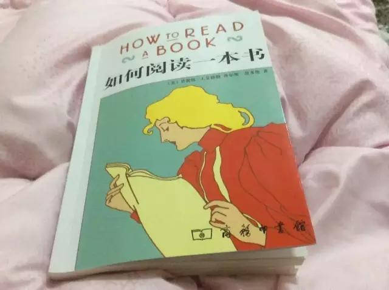

#第一层次，基础阅读（初级阅读、基本阅读或初步阅读）
不管哪一种名称，都指出一个人只要熟练这个层次的阅读，就摆脱了文盲状态，至少一开始认字了。在熟练这个层次的过程中，一个人可以学习到阅读的基本艺术，接受基础阅读训练，活的初步的阅读技巧，这个层次通常在小学时完成的。

这一层次阅读你所要问得问题是：“这个句子在说什么？”

#第二层次，检视阅读
特点在强调时间，在这个阅读层次，学生必须在规定的时间内完成一项阅读的功课。也可以用另外一种方式来形容这个层次的阅读，就是在一定时间内抓住一本书的重点――通常是很短的，而且总是（就其定义上说）过短，很难掌握一本书所有重点。这个层次的阅读也可以用其他称呼，譬如略读或预读，我们并不是说略读就是随意或随便浏览一本书。检视阅读是系统化略读的一门艺术。

用检视阅读完一本书后，无论你用了多长时间，你都该回答得出这样的问题：“这本书在谈什么？这是哪一类的书？这本书包含哪些部分？”

###检视阅读一：有系统的略读或粗读。
1. 先看书名页，然后如果有序言就先看序。
2. 研究目录页。对这本书的基础架构做概括性的理解。
3. 如果书中附有索引，也要检阅一下――大多数论说类的书籍都有索引。
4. 读一下出版者的介绍。
5. 开始挑几个看来跟主题息息相关的篇章来看。
6. 最后一步，把书打开来，东翻翻西翻翻，念一个片段，有时候连续读几页，但不要太多。

###检视阅读二：粗浅的阅读。
这个规则很简单：头一次面对一本难读的书的时候，从头到尾读完一遍，碰到不懂得地方不要停下来查询或思索。只注意您能理解的部分，不要为一些没法立即了解的东西而停顿，不要被一个看不懂的章节、注解、评论或参考资料阻扰或泄气。

**阅读的速度**
许多书其实连略读都不值得的，另外一写书只需要快速读过就行了，有少数书需要用某种速度，通常是相当慢的速度，才能完全理解。所谓阅读速度，理想上来说，不只是要能读的快，还要能用不同的速度来阅读，要知道什么时候用什么样的速度是恰当的。

李笑来在他的《新生，七年就是一辈子》中说道：“阅读速度”是个没用的概念，在我眼里，只有“理解速度”，理解速度快，才能有效提高阅读量。遇到好书，我会抽时间朗读完，一本二十万字左右的书朗读完，也不过十几个小时，中间断断续续，也能一个星期内搞定。更多的时候，时间花在那些需要停下来认真思考的部分，需要停下来心平气和地开开脑洞的部分，需要反复搜索寻找更多资料与关联的部分……反正，眼球快速移动本身，没有任何意义。

**逗留与倒退**
要矫正眼睛逗留与一点的工具有很多种，有些很复杂又很昂贵。无论如何，任何复杂的工具其实都比不上你的一双手来得有用，你可以利用双手训练自己的眼睛，跟着章节段落移动得越来越快。

**理解的问题**
无论速度如何，理解是最重要的。

#第三层次，分析阅读
比起前两种这种阅读要更复杂，更系统化。分析阅读就是全盘阅读、完整阅读，或是说优质阅读――你能做到的最好的阅读方式。如果说检视阅读是在有限的时间内最好也最完整的阅读，那么分析阅读就是在无线的时间里，最好也最完整的阅读。

分析阅读是一种专注的活动，在这个层次的阅读中，读者要读到这本书成为他自己为止，分析阅读就是咀嚼与消化一本书。

#第四层次，主题阅读
这是最高层次的阅读，也是阅读中最复杂也最系统化的阅读。也可以用另外的名称来形容这样的阅读，如比较阅读。

在做主题阅读时阅读者通常会读很多书而不是一本书，并列举出这些书之间的相关之处，提出一个所有的书都谈到的主题。借助他所阅读的书籍，主题阅读者要能够架构出一个可能在哪一本书里都没有提到过的主题阅读分析。因此，很显然的，主题阅读是最主动、也是最话力气的一种阅读。

-----------------------------
本文是《如何阅读一本书》的札记之一