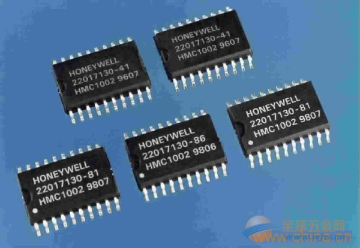
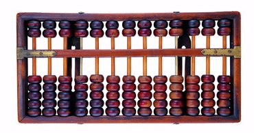
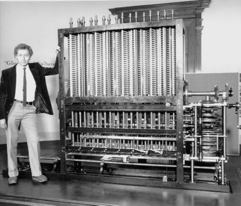
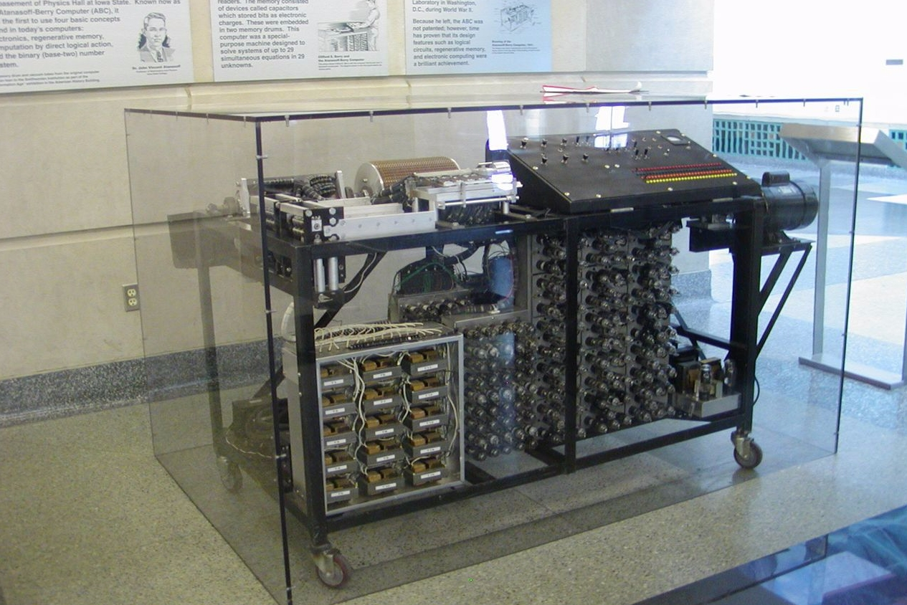
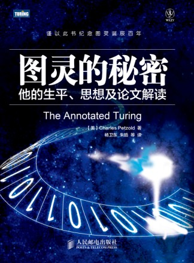
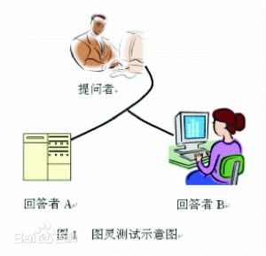

本文将从宏观上对计算机做一个介绍，不讨论硬件底层细节，请放心，完全看得懂。并且简单介绍一下计算机的发展

## 原则一：输入、运算、输出是硬件的基础

从硬件上来讲，可以说计算机是执行输入、运算、输出三种操作的机器。计算机的硬件由大量的IC（集成电路）组成，每块IC上都有大量的引脚，这些引脚有些用于输入，有些用于输出。IC会在其内部对外部输入的信息进行运算，并把运算结果输出到外部。运算这个词听起来也许有些难以理解，但实际上就是计算的意思。举例来说，1+2=3，计算机所做的事就是“输入”数据1和2，然后对它们进行加法“运算”，最后“输出”计算结果3。

其实计算机就是一台简单的机器，它也只能做这三件事。输入、运算、输出必须成套出现，缺一不可。为什呢？
第一，现在的计算机还没有发展到能通过自发的思考创造出信息的地步，因此不输入信息计算计就不能工作。
第二，计算机不能不执行任何运算，如果只是使输入的信息绕过运算环节直接输出，那么这就是电线而不是计算机了，如果不进行运算，计算机也就没有什么存在的意义了。
第三，如果不输出结果，那么这也不是计算机而只是堆积信息的垃圾箱了，所以输出也必不可少。

## 原则二：软件是指令和数据的集合

什么是程序？所谓程序，其实非常简单，只不过是指令和数据的集合。无论程序多么高深多么复杂，其内容也都是指令和数据。
那什么是指令？所谓指令，就是控制计算进行输入、运算、输出的命令。

程序中的数据分为两类，一类是作为指令执行对象的输入数据， 一类是从指令的执行结果得到的输出数据。一般在编写程序的过程中，都要先编译再执行，所谓编译就是把用编译型语言如C、Java、C#等编写的源文件转换成字节码文件，也可以说是机器语言或原生代码。因为计算机只认识二进制，只认识0和1，由一大堆的二进制代码组成的程序就叫机器码、机器语言。

## 原则三：计算的处理方式有时与人们的思维习惯不同

计算机有计算机的处理方法，这是三大原则中的最后一点。计算机本身只不过是为我们处理特定工作的机器。如果计算机能自己干活的话，那么我们的生活太美好了，我一定买很多台。不过遗憾的是目前还没有这样的计算机，现在的计算机终究是受人支配的工具。

对计算机来说什么都是数字。用数字表示所有信息，这就是一个很具代表性的计算机式的处理方式，这一点正是和人类的思维习惯不一样的地方。例如，人们会用”蓝色“”红色“之类的词语描述有关的颜色信息。可是换做计算机的话，就不得不用数字表示颜色信息。例如：用”0,0,255“表示蓝色，用”255,0,0“表示红色，用”255,0,255“表示由蓝色和红色混合而成的紫色。不光是颜色，计算机对文字的处理也是如此。计算机内部会先把文字转换成相应的数字再做处理，这样的数字叫做”字符编码“。总之，计算机会什么都用数字来表示。

## 计算机的进化

计算机的进化只有一个目的——与人类更加相近。要想更加贴近人类，就必须从计算机的处理方式中摒弃不符合人类思维习惯的部分，其实按照这么一来，计算机的进化最终形态就是机器人了，与着人类一样的外表，可以使用人类的语言。说到机器人，推荐一部印度科幻电影《宝莱坞机器人之恋》，讲的就是机器人拥有了人类的思维和感情后机器人做出的疯狂行为，无论从哪个角度这都是一部非常棒的科幻电影，浓郁的印度阿三风格，看惯了好莱坞来看这部电影，会给你重新认识印度的电影水准，简直秒杀我们中国科幻电影好几条街！

如果与前几十年相比，我们身边的个人计算机一直在进化，在逐渐贴近人类。上个世纪80年代中期盛行的计算机操作系统是MS-DOS，它的操作方法是在全黑的画面上敲入字符，把命令传给计算机。进入90年代后，MS-DOS进化成了windows，1995年，微软发布了划时代的windows95操作系统，用户开始可以在图形界面上通过鼠标操作直观的下达命令。

### 算盘

从广义上上说，世界上第一台计算机大约是4000年前被发明的，你知道是什么吗？就是算盘！这是第一种被设计帮助人类计数和计算的机器。

算盘勉强也符合计算机三大原则的输入、运算、输出，所以算盘也可以称为是计算机，其实更符合的叫法应该叫计算器。他是人力驱动的。

关于算盘是不是计算机，是不是第一台计算机是有争议的，不同的的资料可能有不同的说法，但是我们没必要去纠结这个，一点意义都没有，关键是要弄懂当人们在讨论计算机的时候到底在谈论什么。

### 巴贝奇与差分机

更加复杂的计算器有英国人查尔斯·巴贝奇与1822年制造了一台能进行8位数的数学运算的机器，叫做”差分机“。

关于巴贝奇这个人，他几乎是一个全才，他本身是一个数学家，他还是一个文学家、哲学家、天文学家以及经济学家，不过他赖以成名的是因为发明差分机和分析机。

差分机的”差分“是什么意思呢？所谓"差分"的含义，是指把函数表的复杂算式转化为差分运算，用简单的加法代替平方运算。1834年设计了更强大的分析机，不是仅仅能够制表的差分机，而是一种通用的数学计算机。但是它的制造要求有非常高的机械工程技术，第二台差分机大约有25000个零件，主要零件的误差不得超过每英寸千分之一，即使用现在的加工设备和技术，要想造出这种高精度的机械也绝非易事。以至于后来它的分析机根本就没法造出来，从来没有真正的使用过分析机。

不管是是差分机还是分析机，主要都是由机器齿轮来驱动运转，以蒸汽机来提供动力，那时候电发现没多久，还没有用电力来驱动机器的方法。

算盘跟这种大型机器比的话简直low的不行，但是算盘也是一个非常精妙的东西。

### ABC机

那么世界上真正第一台电子计算机是什么呢，注意，是”电子“计算机。我姑且把之前的那些什么算盘、巴贝奇差分机叫做齿轮计算机吧，这是我个人的说法。大家以为ENIAC是世界第一台电子计算机吗？其实不是的，世界上第一台电子计算机叫”阿塔纳索夫-贝瑞计算机“，也简称ABC机，它是1937年设计的不可编程，仅仅设计用于求解线性方程组的计算机。

它的特点：
第一，采用电能与电子元件，在当时就是电子真空管；
第二，采用二进位制，而非通常的十进位制；
第三，采用电容器作为存储器，可再生而且避免错误；
第四，进行直接的逻辑运算，而非通常的数字算术。

从ABC开始，人类的计算从模拟向数字挺进。

### ENIAC

那么接下来说的这个计算机就是世界上第一台”通用电子计算机“，它于1946年在美国宾夕法尼亚大学诞生，它的诞生是为了战争而生的，专门为了计算弹道和射击特性表面而研制的。没错他就是ENIAC。它是图灵完全的电子计算机，能够重新编程，解决各种计算问题。注意“通用”“图灵完全”“重新编程”这三个词语，这是它的特点。
这台计算机主要元器件采用的是电子管 。

### 冯·诺依曼与冯·诺依曼计算机

提到计算机，就不能不提到冯诺依曼这个人，被称为计算机之父。它提出程序存储的思想，明确规定用二进制替代十进制运算，并将计算机分成五大组件（运算器、控制器、存储器和输入输出设备），计算机应该按照程序顺序执行。人们把冯诺依曼的这个理论称为冯诺依曼体系结构，根据这些原理制造的计算机被称为冯·诺依曼结构计算机，从EDVAC到当前最先进的计算机都采用的是冯诺依曼体系结构。世界上第一台冯·诺依曼式计算机是1949年研制的EDVAC，也是为美国陆军弹道研究实验室研制。

上面提到了好多个世界第一，第一台计算机是算盘，第一台电子计算是ABC机，第一台通用电子计算机是ENIAC，第一台冯诺依曼计算机是EDVAC。

### 阿兰·图灵与图灵机

除了冯诺依曼，提到计算机还要提到另一个神仙，它就是阿兰·图灵。图灵是一个英国数学家和逻辑学，注意，是数学家，数学家，数学家，重要的事情说三遍，前面说的巴贝奇也是数学家，在计算机研究这个行当里，一定程度上就是数学研究，玩计算机就是玩数学，很多情况下，计算机的重大突破都是由某些数学理论的成功应用，特别是算法，TMD的就是数学，所以搞计算的数学要好，对于我们非英语国家来说，还要加上英语好，我们真的很苦逼....他居然还是逻辑学家，简直牛逼的不要不要的，更看不懂的是他后来一直在搞数理生物学方面的研究，正因为这么牛逼上帝也看上了他，于是1954在他41岁的时候上帝终于把他弄天上去了，上天了......。逻辑学在计算机中也是很重要的应用，特别是硬件底层，硬件里面其实就是一堆开关，一堆继电器，一堆逻辑门，一堆true和false，一堆0和1.

阿兰·图灵在二战的时候是为英国搞密码破译的，专门破译德国密码，做出过很多重大贡献，一定程度上左右了英国当时的战争局势，关于图灵还有很多秘密，现在有一本书叫《图灵的秘密》，由图灵教育公司出版的，专门介绍他的生平、思想及论文解读，大家有兴趣可以买来看看。

好了，上面扯了一堆题外话，那么，图灵在计算机上到底有什么贡献呢？他有很多理论，比如可计算性、判定问题，这个说起来就复杂了，我就不细讲了，其实我根本就搞不懂，太烧闹了。简而言之，图灵的基本思想是用机器来模拟人们用纸笔进行数学运算的过程，他是一种抽象的计算模型，符合这个模型的就叫图灵机。他还人工智能方面有一个有意思的东西，叫图灵测试。图灵测试就是说，如果一台机器能够与人类展开对话（通过电传设备）而不能被辨别出其机器身份，那么称这台机器具有智能。举例说比如你隔壁老王家有一台能说话的计算机，而且声音跟老王一样，那么你跟他隔墙喊话，你问一句他回答一句，你如果不能区分这次喊话到底是老王本人在回答，还是他的电脑在回答，那么就说这个电脑通过了图灵测试，具有智能。

### 计算机的代际

最后再说一下计算机的代际。

第一代计算机被称为电子管计算机，为什么要叫电子管计算机呢？因为这一阶段计算机的主要特征是采用电子管元件作基本器件，代表计算机是ENIAC和ABC机。

第二代计算机被称为晶体管计算机，晶体管的出现使计算机生产技术得到了根本性的发展，同时程序语言也相应的出现了，如Fortran ，Cobol ，Algo160等计算机高级语言。

第三代计算机成为中小规模集成电路计算机，随着半导体工艺的发展，中小规模集成电路成为计算机的主要部件，使计算机的体积更小，大大降低了计算机计算时的功耗。在软件方面，有了标准化的程序设计语言和人机会话式的Basic 语言，其应用领域也进一步扩大。

第四代计算机成为大规模和超大规模集成电路计算机，这一带计算机的体积进一步缩小，性能进一步提高。发展了并行技术和多机系统，出现了精简指令集计算机 （RISC），软件系统工程化、理论化，程序设计自动化。我们现在就是处于第四代计算机向第五代过度的阶段。

第五代计算机，指具有人工智能的新一代计算机，它具有推理、联想、判断、决策、学习等功能。

**************************
**参考资料：**

* 《计算机是怎么跑起来的》[日]矢泽久雄，人民邮电出版社，2015.5
* [http://baike.baidu.com/view/11592253.htm](http://baike.baidu.com/view/11592253.htm)
* [http://baike.baidu.com/view/3240731.htm](http://baike.baidu.com/view/3240731.htm)
* [http://www.baike.com/wiki/计算机发展史](http://www.baike.com/wiki/计算机发展史)
* [http://baike.baidu.com/view/593829.htm](http://baike.baidu.com/view/593829.htm)
* [http://baike.baidu.com/view/22486.htm](http://baike.baidu.com/view/22486.htm)
* [http://baike.baidu.com/view/94296.htm](http://baike.baidu.com/view/94296.htm)

