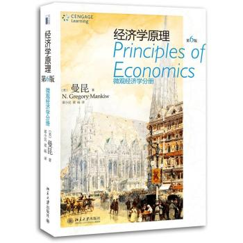

【== 第1篇 导言 ==】
===============================
-------------------------------------------------------

第一章 经济学十大原理
=============================
【内容提要】
-----------------
**人们如何做出决策**       	
1. 人们面临权衡取舍（人们面临不同目标之间 的权衡取舍）
2. 某种东西的成本是为了得到它所放弃的东西（任何一种行为的成本可以用其所放弃的机会来衡量）
3. 理性人考虑边际量（理性人通过考虑边际成本与边际利益来做出决策）
4. 人们会对激励做出反应（人们根据他锁面临的激励改变自己的行为）

**人们如何相互交易**
5. 贸易可以是每个人的状况都变的更好（贸易以及相互依赖性可以是互利的）
6. 市场通常是组织经济活动的一种好方法
7. 政府有时可以改善市场结果（通过纠正市场失灵或者提高经济中的平等程度，政府可以潜在的改善市场结果）

**整体经济如何让运行**         	
8. 一国的生活水平取决于它生产物品与劳务的能力（生成率是生活水平的最终根源）
9. 当政府发行了过多的伙伴时，物价上涨（货币量的增长是通货膨胀的最终根源）
10. 社会面临通货膨胀与失业之间的短期权衡取舍

【关键概念】
-----------------------------------------
**稀缺性**：社会资源的有限性	
**边际变动**：对行动计划的微笑增量调整	
**市场势力**：单个经济活动者对市场价格有显著影响的能力
**经济学**：研究社会如何管理自己的稀缺资源	
**激励**：引起一个人做出某种行为的某种东西	
**生产率**：每一单位劳动的投入所生产的物品与劳务数量
**效率**：研究能从稀缺资源中得到最大的利益的特性	
**市场经济**：当许多企业和家庭在物品与劳务市场上相互交易时，通过他们的分散决策配置资源的经济	
**通货膨胀**：经济中物价总水平的上升
**平等**：经济成果在社会成员平均分配的特性	
**产权**：个人拥有并控制稀缺资源的能力	
**经济周期**：就业和生产等经济活动的波动
**机会成本**：为了得到某种东西而必须放弃的东西	
**市场失灵**：市场本身不能有效控制资源的情况	
**理性人**：系统而又目的的尽最大努力实现其目标的人	
**外部性**：一个人的行为对旁观者的福利的影响	

第二章 像经济学家一样思考
============================
###1、经济学家如何运用科学的逻辑来考察经济如何运行的一些方法：
+ 科学方法：观察、理论和进一步观察
+ 假设的作用
+ 经济模型
    a. 循环流量图
    b. 生产可能性边界

###2、宏观经济学与微观经济学的区别
微观经济学：研究家庭和企业如何做出决策，以及他们如何在特定市场上相互交易。
宏观经济学：研究整体经济现象，包括通货膨胀、失业和经济增长。

###3、实证表述与规范表述的区别
实证表述：视图描述世界是什么样的观点。
规范表述：视图描述世界应该是什么样子的观点。

###4、经济学家意见分歧的原因
1. 科学判断不同
2. 价值观的不同
3. 感觉与现实

第三章 相互依存性与贸易的好处
===============================
1. 每个人都消费本国和世界各国许多其他人所生产的物品与劳务。相互依存和贸易之所以相互合意，是因为他可以使每个人都可以享有更多数量和品种的物品和劳务。
2. 绝对优势：用比另一个生产者更少的投入生产某种物品的能力。
      比较优势：一个生产者已低于另一个生产者的机会成本生产一种物品的行为。
3. 有两种方法可以用来比较两个人在生产一种物品时的能力。一个人可以用较少的投入生产该物品的人被称为在生产改物品上有绝对优势。生产该物品的机会成本较少的人被称为有比较优势。贸易的好处是基于比较优势而不是绝对优势。
4. 贸易可以使每个人的状况变的更好，因为它使人们可以专门从事自己有比较优势的活动。
5. 比较优势原来不仅适用于个人，还使用与国家。经济学家用比较优势原理支持各国之间的自由贸易。

【== 第2篇 市场如何运行 ==】
=====================================
------------------------------------------------------
第四章 供给与需求的市场力量
====================
1. 经济学家用供求模型来分析竞争市场。在竞争性市场上，有许多的买者和卖者，他们每个人对市场价格影响很小，甚至没有影响。
2. 需求曲线表示价格如何决定一种物品的需求量。根据需求定理，随着一种物品价格下降，需求量增加。因此需求曲线向右下方倾斜。
3. 市场需求是个人需求之和。
4. 几个概念：
    a. 正常物品：在其他条件相同时，收入增加引起需求增加的物品。
    b. 低档物品：在其他条件相同时，收入增加（减少）引起需求量减少（增加）的物品。
    c. 替代品：一种物品价格上升引起另一种物品需求量增加的物品。
    d. 互补品：一种物品价格升水引起另一中物品需求量减少的物品。
5. 除了价格之外，决定消费者想购买多少物品的其他因素包括收入、替代品和互补品的价格、嗜好、预期和卖者数量。如果这些因素的其中一种改变了，需求曲线就会移动。
6. 供给曲线表示价格如何决定一种物品的供给量。根据供给定理，随着一种物品价格上升，供给量增加。因此，供给曲线向右上方倾斜。
7. 除了价格之外，决定生产者想出售多少物品的其他因素包括投入品价格、技术、预期和买者的数量。如果这些因素的其中一种改变了，供给曲线就会移动。
8. 供给曲线与需求曲线相交决定了市场均衡。当价格为均衡价格时，需求量等于供给量。
9. 买者与卖者的行为会自然而然的使市场趋向均衡。当市场价格高于均衡价格时，存在捂盘过剩，引起市场价格下降。当市场价格低于均衡价格时，存在捂盘短缺，引起价格上升。
10. 为了分析一个事件如何影响一个市场，我们用供求图来考察该事件对均衡价格和均衡数量的影响。我们要遵循三个步骤进行：
    a. 确定该事件是使需求曲线移动还是供给曲线移动，还是都移动。
    b. 去顶曲线移动的方向。
    c. 比较新均衡和原来的均衡。
11. 在市场经济中价格是引导经济决策，从而配置稀缺资源的信号。对于经济中的每一种物品来说，价格确保供给与需求达到平衡。因此，均衡价格决定买者和卖者的选择。

第五章 弹性及其应用
=============================
1. 什么是弹性？
    衡量需求量或供给量对其某种决定因素的反应程度指标。
2. 什么是总收益？
    即对一种物品的总支付量=价格X销售量。对于缺乏弹性的需求曲线，其总收益随着价格上升而增加。对于富有弹性的需求曲线相反。

第六章 供给、需求与政府政策
================================
1. 是什么引起物品短缺和剩余？
如果价格上限低于均衡价格，则需求量大于供给量，引起短缺。价格下限相反。
2. 当政府对某种物品征税时有什么影响？
当政府对某一种物品征税时，改物品的均衡数量减少，也就是说，对某市场征税缩小了改市场规模。
3. 谁负担了税收？
从这种意义上说，买者与卖者分摊了税收负担。
4. 税收归宿取决于供给和需求的价格弹性。税收负担更多的落在缺乏弹性的市场一方，因为市场的这一方较难通过改变购买量或销售量来对税收做出反应。

【== 第3篇 市场和福利 ==】
==================================
-----------------------------------------------------------
第七章 消费者、生产者与市场效率
==============================
1. 什么是福利经济学？研究资源配置如何影响经济福利的一门学问
2. 消费者剩余等于买者对一种物品的支付意愿减去器实际支付的量，它衡量买者从参与市场中得到的利益。可以通过找出需求曲线一下的和价格以上的面积，来计算消费者剩余。
3. 生产者剩余等于卖者出售起物品得到的量减去其生产成本，它衡量卖者从参与市场中的到的利益。可以通过找出价格以下和供给曲线以上的面积来计算。
4. 使消费者剩余和生产者剩余的总和和最大化的资源配置被称为是有效率的。决策者通常关心经济结果的效率以及平等。
5. 供给与需求的均衡使消费者剩余与生产者剩余总和最大化。这就是说，市场中看不见的手指引着买者与卖者有效地配置资源。
6. 存在市场势力或外部性等市场失灵的情况下，市场不能有效的配置资源。

第八章 应用：赋税的代价
===========================
1. 无谓损失：当税收（或其他牟某种政策）扭曲了市场结果时，所引起的总剩余减少被称为无谓损失。
2. 一种物品的税收使该物品卖者和买者的福利减少了，而且，消费者剩余和生产者剩余的减少的量通常超过了政府筹齐到的税收收入。
3. 税收带来的无谓损失，是因为他使买者少消费，使卖者少生产，而且，这种行为变动使市场规模缩小到使总剩余最大化的水平之下。由于供给弹性和需求弹性衡量市场参与者对市场状况变动的反应程度，所以，弹性越大意味着无谓损失也越大。
4. 税收增加越多，它对激励的扭曲越大，无谓损失也就越大。但由于税收减少了市场规模，税收收入不会一直增加，税收收入达到一定的规模，就开始下降。（拉弗曲线）
5. 拉弗曲线：

第九章 应用：国际贸易
============================
1. 通过比较有没有国际贸易时的国内价格和世界价格，可以确定自由贸易的影响。
    a. 国内价格低表明，该过在生成这种物品上具有比较优势，而且将成为出口国。
    b. 国内价格高表明，四姐其他国家在生成该物品时具有比较优势，而且该国将成为进口国。
2. 当一国允许贸易并成为一种物品的出口国时，改物品的生成者状况变好了，而改物品的消费者状况变坏了。反之，则相反。
在这两种情况下，贸易的好处都大于损失。
3. 国际贸易的其他好处还有：增加物品的多样性；通过国民经济降低了成本；增加了竞争；加强了思想交流。
4. 关税――对进口物品征收的一种税――使市场向没有贸易时的均衡移动，因此，减少了贸易的好处。虽然国内生产者的状况变好了，而且政府收入增加了，但消费者的损失大于这些好处。
5. 有各种限制自由贸易的观点：保护工作岗位、保卫国家安全、帮助幼稚产业、防止不公平竞争以及对外国的贸易限制做出反应。尽管这些观点在某些情况下有些道理，但经济学家相信，自由贸易通常是一种更好的政策。

【== 第4篇 公共部门经济学 ==】
===============================
---------------------------------------------------
第十章 外部性
==============================
1. 什么是外部性？
    当卖者和卖者之间的交易间接影响第三方时，这种影响称为外部性。
2. 外部性分为正外部性和负外部性。
    如果一场活动产生可负外部性，例如污染，社会的最适量将小于均衡量。
    如果一个活动产生了正外部性，例如技术溢出，社会最适量将大于均衡量。
3. 什么是外部性的内在化：改变激励，以使人们考虑到自己的行为的外部效应。
4. 针对外部性的公共政策有哪些？
    a. 命令与控制政策：管制。解决外部性引起的无效率。
    b. 以市场为基础的政策:1：矫正税与补贴。使外部性内在化。
            矫正税：旨在引导私人决策者考虑负外部性引起的社会成本的税收。
    c. 以市场为基础的政策2：可以交易的污染许可证
5. 什么是后科斯定理？
    认为如果私人各方可以无成本地就资源配置进行协商，那么他们就可以自己解决外部性问题的一个命题。
    **科斯定理说明**：私人经济主体可以解决他们之间的外部性问题。无论最初的权利如何分配，有关各方面总可以以达成一种协   议，在这种协议中，每个人的状况都可以变的更好，而且，结果是有效率的。
    但在许多情况下，在许多利益各方间达成协议是很困难的，从而科斯定理并不适用。

第十一章 公共物品和公共资源
===========================
1. 物品的两个特点和四种类型
    + 排他性：一种物品具有可以阻止另一个人适用该物品的特性。
    + 消费中的竞争性：一个人使用一种物品将减少其他人对改物品的使用的特性。
    根据以上两个特性，可以吧物品分成四种类型：
    a. 私人物品：既有排他性，又有竞争性的物品，例如冰淇淋蛋卷。
    b. 公共物品：既无排他性，也无竞争性的物品，例如小镇上的龙卷风警报器。
    c. 公共资源：有竞争性，但无排他性的物品，例如海洋中的鱼。
    d. 俱乐部物品：有排他性，但无竞争性的物品，比如消防。
    市场最适用于既有排他性又有竞争性的私人物品。市场运行最不适用于其他类型的物品。
2. 由于不能对使用公共物品的恩收费，所以在私人提供这种误判时，人们存在搭便车的激励。因此，政府提供公共物品，并以成本――收益分析为基础做出关于每种物品的供给量的决策。
3. 公共资源在消费中有竞争性但无排他性。例子包括公有草地、清洁的空气和拥挤的道路。由于不能向使用公共资源的人收费，他们玩玩会过度的使用公共资源。因此，政府努力用各种方法限制公共资源的使用。
4. 结论：产权的重要性。

第十二章 税制的设计
===========================
1. 美国的税收筹齐收入
    + 联邦政府最重要的税是个人所得税和用于社会保障的工薪税。
    + 州政府和地方政府最重要的税是销售税和财产税。
2. 税制的效率
    税制的效率是指他给纳税人带来的成本。除了资源从纳税人向政府的转移，税收还有两种成本：
    + 税收改变了激励、扭曲了资源配置二带来的无谓损失。
    + 遵从税法的管理负担。
3. 税制的平等
    税制的平等设计税收负担是否公平地在个人之见进行分配。
    + 根据收益原则，人们根据他们从政府得带的收益来纳税是公平的。
    + 根据支付能力原则，人们根据他们的承受财务负担的能力来纳税是公平的。
    当评价税制的平等性时，记住从税收归宿研究中得出一条结论是很重要的：税收担负的分配与税单的分配不是一回事。
4. 当考虑税法变动时，决策者经常面临效率与公平之间的权衡取舍。大多数关于税收政策争论的产生是因为人们对这两个目标的侧重点不同。

【== 第5篇 企业行为与产业组织 ==】
==================================
----------------------------------------------------------
第十三章 生产成本
====================
1. 总收益、总成本和利润
    企业的目标是利润最大化，利润=总收益-总成本
2. 成本包括显性成本和隐性成本。显性成本指企业需要指出货币的投入成本；隐性成本指不需要企业支出货币的投入成本。
3. 什么是经济利润和会计利润
   + 经济利润：经济学家衡量企业的经济利润，即企业的总收益减去生成所销售物品与劳务的总机会成本（包括显性成本和隐性成本）
   + 会计利润：会计师衡量企业的会计利润，即企业的总收益仅仅减去总成本（不包括隐性成本）
4. 几个术语概念:
    a. 生产函数：用于生产一种物品的投入量与改物品产量之间的关系。
    b. 边际产量：增加一单位投入所引起的产量增加。
    c. 边际产量递减：一种投入的边际成产量随着投入量增加而减少的特征。
    d. 平均总成本（ATC）：总成本（TC）/产量（Q）。
    e. 规模经济：长期平均总成本随着产量增加而减少的特性。
    f. 规模收益不变：长期平均总成本在产量变动时保持不变的特性。
    g. 平均总成本（ATC）=总成本（TC）/产量（Q）
    h. 平均固定成本（AFC）=固定成本（FC）/产量（Q）
    i. 平均可变成本（AVC）=可变成本（VC）/产量（Q）
    j. 边际成本（MC）：额外一单位产量所引起的总成本的增加（∑TC/∑Q）。
5. 企业的总成本可分为固定成本和可变成本。固定成本是企业改变产量时不变的成本。可变成本是企业改变产量时改变的成本
6. 在分析企业行为时，画出平均总成本和边际成本的图形往往是有所帮助的。对一个典型企业来时候说，边际成本随着产量增加而增加。平均总成本随着产量增加先下降，然后随着产量作进一步增加而上升。边际成本曲线总是与平均总成本曲线相交与平均总成本的最低点。
7. 一个企业的成本往往取决于所考虑的时间框架。特别是，许多成本在短期中是固定的，但在长期中是可变的。结果，当企业改变其产量水平的时候，短期中的平均总成本可以比长期中增加更快。

第十四章 竞争市场上的企业
=========================
1. 由于竞争企业是价格接受者，所以他的收益与产量是同比例的。物品价格等于企业的平均收益和边际收益。
2. 为了使利润最大化，企业选择使边际收益等于边际成本的产量。由于竞争企业的边际收益等于市场价格，所以企业选择使价格等于边际成本的产量。因此，企业的边际成本曲线又是他的供给曲线。
3. 在短期中，当企业不能回收期规定成本时，如果物品价格小于平均可变成本，企业将选择暂时性停止营业。在长期中，当企业不能收回其固定成本和可变成本时，如果价格小于平均总成本，企业将选择退出市场。
4. 在可以自由进入与退出的市场上，长期中利润为零。在长期均衡时，所有企业都在有效规模上生产，价格等于最低平均总成本，而且，企业数量会自发调整，以满足在这种价格时的需求量。
5. 需求变动在不同的时间框架之内有不同的影响。在短期中，需求增加引起价格上升，并带来利润，而需求减少引起价格下降，并带来亏损。但如果企业可以自由进入和退出市场，那么，在长期中企业数量将自发调整，是市场回到零利润均衡。

第十五章 垄断
========================
1. 垄断怎样产生？
垄断者是在其市场上位唯一卖者的企业。当一个企业拥有一种关键资源，当政府给一个企业排他性生产一种物品的权利，或者当一个企业可以比许多同行企业以较低成本供给整个市场时，垄断就产生了。
2. 垄断者边际收益总是低于其物品的价格。
由于垄断者是市场上的唯一生产者，所以他面临向右下角倾斜的产品需求曲线。当垄断增加一单位产量时，就一起他的产品价格下降，这就减少了所有单位的产量赚到的收益量。因此，垄断者边际收益总是低于其物品的价格。
3. 垄断企业的物品价格高于边际成本。
和竞争企业一样，垄断企业也通过生产边际收益等于边际成本的产量来实现利润最大化。这是垄断者根据需求量选择价格。与竞争企业不同，垄断企业的价格高于它的边边际收益，因此它的价格高于边际成本。
4. 垄断者也会引起无谓损失。
垄断者利润最大化的产量水平低于使消费者剩余与生产者剩余之和最大化的产量水平。这就是说，当垄断者收取高于边际成本的价格时，一些对物品评价大于其生产成本的消费者不再购买这种物品。因此，垄断者引起无谓损失类似于税收引起的无谓损失。
5. 关于价格歧视的论述。
垄断者通常可以通过根据买者的支付意愿对同一种物品收取不同的价格来增加利润。这种价格歧视的做法可以通过使一些本来不想购买的消费者购买物品从而增加经济福利。在完全价格歧视的极端情况下，垄断的无谓损失完全消除了。而且市场所有的剩余归垄断生产者。在更一般的情况下，当价格歧视不完全时，与单一垄断价格相比，它会增加或减少福利。
6. 决策者可以通过四种方式对垄断行为的无效率做出反应
    a. 用反托拉斯法使行业更具竞争性；
    b. 管制垄断者收取的价格；
    c. 把垄断者变为政府经营的企业；
    d. 或者，如果与政策不可避免的不完善性相比，市场失灵的程度相对要小，政府可以选择不作为。

第十六章 垄断竞争
==============================
1. 垄断竞争市场有三个特点
    许多企业、有差别的产品和自由进入
2. 垄断竞争市场的均衡在相关的两个方面不同于完全竞争市场。
    a. 垄断竞争市场上的每个企业有过剩生成能力。也就是说，他在平均总成本曲线右下方倾斜的部分运营。
    b. 每个企业都收取高于边际成本的价格。
3. 垄断竞争没有完全竞争所有合意的特点，存在由高于边际成本的价格加成引起的垄断的标准无谓损失。此外，企业的数量（以及产品的种类）可能过多或过少。实际上，决策者纠正这些无效率的能力是有限的。
4. 广告与品牌的争论
垄断竞争中固有的产品差别使企业使用广告与品牌。广告与品牌的批评者认为，企业用广告控制了消费者的偏好，并减少了竞争；广告与品牌的辩护者认为，企业用这些方法向消费者提供信息，并使价格和产品质量上的竞争更为激烈。

第十七章 寡头
====================
1. 什么是寡头与寡头的形成。
    寡头是指：只有少数几个卖者提供相似或相同产品的市场结构。
    寡头的形成：通过形成一个卡特尔（联合起来行事的企业集团）并像垄断者一样行事以使自己的总利润最大化。但如果寡头独立地做出生成决策，结果是   产量大于垄断产量，价格低于垄断价格。在寡头市场上企业数量越多，产量和价格越接近与竞争状态下的水平。
2. 囚徒困境
    两个被捕的囚徒之间一种特殊“博弈”，说明为什么甚至在合作对方都有理时，保持合作也是困难的。
3. 囚徒困境表名，利己使人们即使在合作符合他们共同利益时也无法维持合作。囚徒困境的逻辑适用于许多情况，包括军备竞赛、公共资源问题和寡头。
4. 决策者用反托拉斯法来防止寡头从事减少竞争的行为。这些法律的适用性是有争议的，因为有些看来可能减少竞争的行为实际上可能有合理的经营目的。

【== 第6篇 劳动市场经济学 ==】
============================
-----------------------------------------------
第十八章 生产要素市场
====================
1. 经济的收入是在生产要素市场上分配的。三种最重要的生产要素是劳动、土地和资本。
2. 要素需求，例如劳动需求，是一种派生需求，它产生于用这些要素生产物品与劳务的企业。竞争的、以利润最大化为目标的企业在某要素的边际产量等于其价格这一点上使用该要素。
3. 劳动的供给产生于个人在工作和闲暇间的权衡取舍。向上方倾斜的劳动供给曲线意味着人们对工资上升是做出更多工作和少享受闲暇。
4. 支付给每种要素的价格的调整使改要素的供求趋于平衡。由于要素需求反应了该要素的边际产量值，在均衡时每种要素根据其对物品和劳务生产的边际贡献得到报酬。
5. 由于生产要素是同时使用的，因此，任何一种要素的边际产量都取决于可以得到的所有要素量。因此，一种要素供给的变动会改变所有要素的均衡收入。

第十九章 收入与歧视
=======================
1. 工人由于许多原因二赚到不同的工资。在某种程度上，工资的差别是对工人工作特性的补偿。在其他条件相等时，从事艰苦、乏味工作的工人得到的工资高于从事轻松、有趣的工作的人。
2. 人力资本多的工人得到的工资高于人力资本少的工人，累积的人力资本的收益是很高的，而且在过去20年来一直在增加。
3. 虽然受教育年限、经验和工作特性都像理论所预期的那样影响收入，但人又许多收入差别不能用经济学家可以衡量的东西来解释。收入中无法解释的变动主要归因于天生能力、努力和机遇。
4. 一些经济学家提出，受教育更多的人得到更高工资并不是因为教育提高了其生成率，而是因为有更高天赋的工人把教育作为一种向雇主显示他们搞能力的信号。如果这种信号理论正确的话，那么，提高所有工人的受教育程度就不会挺高整个工资水平。
5. 有时工资会高于使供求平衡的水平。高于均衡的工资产生的三个原因是最低工资法、公会和效率工资。
6. 收入中的一些差别是基于种族、性别或其他因素的歧视。但是，歧视的衡量是很困难的，因为必须根据人力资本和工作特性的差别进行矫正。
7. 竞争市场倾向于限制歧视对工资的影响。如果一个工人群体的工资由于与边际生成率无关的原因而低于另一个工人群体，那么，非歧视企业将比歧视企业盈利跟多。因此，利润最大化行为可以减少歧视性工资差别。如果顾客愿意向歧视企业支付更多，或如果政府通过要求企业歧视的法律，竞争市场上的歧视就会持续下去。

第二十章 收入不平等与贫困
============================
1. 由于实物转移支付、经济生命周期、暂时收入和经济流动性对于理解收入变动如此重要，以至于要用某一年的收入分配数据来判断我们社会中的不平等程度是很困难的。当考虑到这些因素时，他们总倾向于表明经济福利的分配比年收入的分配更公平。
2. 政治哲学家在关于政府在改变收入分配中的作用的观点并不相同。功利主义者选择使社会中每个人效用之和最大化的收入分配。自由主义者决定收入分配时，我们放佛被放置于“无知面纱”之下，这使我们不了解自己的生活状况。自由至上主义者要求政府保护个人权利以保证一个公正的过程，但不用关注其所引起的收入分配结果的不平等。
3. 有许多旨在帮助穷人的不同政策――最低工资法、福利、付所得税以及实物转义支付。虽然这些政策都帮助了一些家庭脱贫，但他们也有意料之外的副作用。由于经济援助随着收入增加而减少，因此，穷人往往面临着很高的有效边际税率。这种高有效税率不鼓励贫困家庭依靠自己的力量脱贫。